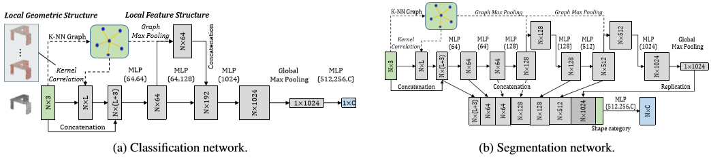
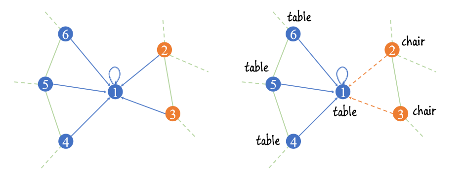

# 🗃 AI-Paper-Drawer
人工智能论文关键点概括集结。This project aims to collect key points of AI papers. 扫码加入QQ交流群832405795 ↓

此 repo 旨在记录各 AI 论文的精简概括，以便大家更好地了解不同邻域的发展脉络。

# 子抽屉
[图神经网络](图网络专区.md)

# Graph 图推理
## 2018
### [【CVPR】](http://openaccess.thecvf.com/content_cvpr_2018/papers/Shen_Mining_Point_Cloud_CVPR_2018_paper.pdf) Mining Point Cloud Local Structures by Kernel Correlation and Graph Pooling

- 点云分类/点云语义分割
- 作者提出俩个方法以小成本提高PointNet效果，捕捉局部信息
  - 作者将点集卷积核定义为一组可学习的3D点，它们根据由核相关性测量的几何关系共同响应一组相邻数据点，改编自点云配准的相似性技术。
  - 第二个利用局部高维特征和结构，通过在固定球半径内逐通道 Mean/Max Pooling，在最近邻图上获得局部特征。
### [【CVPR】](https://engineering.purdue.edu/~jshan/publications/2018/Lei%20Wang%20Graph%20Attention%20Convolution%20for%20Point%20Cloud%20Segmentation%20CVPR2019.pdf) Graph Attention Convolution for Point Cloud Segmentation

- 点云语义分割
- 本文引入注意力机制解决图卷积各向同性问题，避免特征污染。将离散卷积核更改为相对位置和特征差分的函数，并利用softmax做归一化。
- 语义分割：堆砌FPS采样后的GAC层进行下采样，上采样时使用NIN卷积对采样点降维和特征插值计算非采样点。

# CV 计算机视觉
## 2017
### [【CVPR】](https://arxiv.org/abs/1612.00593) PointNet: Deep Learning on Point Sets for 3D Classification and Segmentation

- 点云分类/点云语义分割
- 本文开创 DL 在无序点云上识别的先河，利用核长为1的卷积对每个点单独升维后使用对称函数（本文利用MaxPooling）获取具有输入排列不变性的全局点云特征。
  - 分类：使用全连接网络对全局特征降维至类别数。
  - 语义分割：在每个升维后的点特征向量（1024维）后拼接上全局特征，再使用单一感受野的卷积降维对每个点做分类。
- T-Net：使用如上操作提取固定多个全局特征构成变换矩阵，左乘点云数据施加线性变换，增加对点云刚性变换的鲁棒性。

# NLP 自然语言处理

# Recommendation 推荐系统

# RL 强化学习

# GANs 生成式对抗

# Others 其他

# 其他
- 想学 🐍 Python？欢迎光临[ LeetCode最短Python题解 ](https://github.com/cy69855522/Shortest-LeetCode-Python-Solutions)，和我们深入探索 Python 特性。
