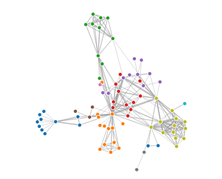
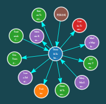

# 🌌 What-Is-Graph-Neural-Network?
This project aims to collect all knowledge points related to graph neural network (basic knowledge, key points analysis of the paper, etc.).
# 前言
- 有关图网络的中文资料太少了 😐 本项目意在收集所有与图神经网络有关的知识点（基础知识、论文要点解析等）。🌴独木不成林，独林不成森。如果您有想要分享的相关知识点或论文要点概括（[解析参考模板](sources/papers/README.md)），欢迎 fork 或 直接发 issue，可提供昵称与联络方式，所有被收录的知识点整理或解析提供者将被记录在文末，整理资料时请一并提供引文出处。能力有限，无法保证所收录内容的绝对准确性，如有疑问或指教，期待与您 issue 相见 ⛄。
- 图网络研究交流QQ群：832405795

# 十万个为什么
本栏目收集所有图网络相关问答 🤡，若您有任何关于图网络的不解之处，欢迎发issue，此处将收录优质提问与解答(如果是某篇特定图网络论文的问题发issue时请标上论文名字，问答将被收录在对应 readme 中)。如果您有意愿分享图网络相关问题的解答，欢迎 fork→PR 或 issue。

## 1. 什么是GNN？
- 图是一种数据结构，它对一组对象（节点）及其关系（边）进行建模。图神经网络（GNN）是一类基于深度学习的处理图域信息的方法。由于其较好的性能和可解释性，GNN 最近已成为一种广泛应用的图分析方法。

## 2. GNN具有哪些优势？
- 图网络可以处理非欧几里得数据。标准的CNN和RNN网络不能处理图输入这种非顺序排序的特征表示。换句话说，图中节点的排序是没有规律可言的。如果非要用传统的CNN和RNN来处理图数据的话，只能遍历图中节点所有可能的出现顺序作为模型的输入，这对模型的计算能力来说是难以承受的。GNN分别在每个节点上传播，忽略了节点之间输入的顺序。换而言之，GNN的输出是不随节点的输入顺序为转移的。

- 图中的边表示两个节点之间的依赖关系。在传统的神经网络中，这种依赖关系只能通过节点的特征表示来体现。GNN可以依赖周围的状态来更新节点的状态。
- 推理能力，与人类从日常经验中获取推理能力相似，GNN能够从非结构化数据（例如:场景图片、故事片段等）中生成图。与之对比的是，传统CNN和RNN能够从大量经验数据中生成完整的图片和文档，但并不能学习出这种推理图（reasoning graph）。
## 3. GNN存在哪些不足？
- 浅层结构：目前GNN还只能在较浅层的网络上发挥优势，随着层数的加深，网络会出现退化。
- 动态图：目前大多方法只能应用在静态图上，对于动态图还没有特别好的解决方案。
- 非结构化场景：还没有一个通用的方法来合理的处理非结构化数据。
- 扩展性：将图网络应用于大规模数据上仍然面临着不小的困难。
## 4. GNN的应用有哪些？
### 节点上的任务
- 风险识别
- 价值排名
- 社群检测
- 用户画像
- 节点分类
### 边上的任务
- 推荐系统
- 知识推理
- 链路预测
### 图上的任务
- 高分子分类
- 点云分类、识别、分割
- 表示学习/图嵌入
- 图聚类
- 图匹配
- 图生成
- 图相似度度量
- 人体骨架识别

## 5. GNN方向常用数据集有哪些？
- Cora：https://s3.us-east-2.amazonaws.com/dgl.ai/dataset/cora_raw.zip
- Pubmed：https://s3.us-east-2.amazonaws.com/dgl.ai/dataset/pubmed.zip
- Citeseer：https://s3.us-east-2.amazonaws.com/dgl.ai/dataset/citeseer.zip
- BlogCatalog：http://socialcomputing.asu.edu/datasets/BlogCatalog
- Reddit：https://github.com/linanqiu/reddit-dataset
- Epinions：http://www.trustlet.org/downloaded_epinions.html
- PPI：http://snap.stanford.edu/graphsage/ppi.zip
- NCI-1：https://ls11-www.cs.uni-dortmund.de/people/morris/graphkerneldatasets/NCI1.zip
- NCI-109：https://ls11-www.cs.uni-dortmund.de/people/morris/graphkerneldatasets/NCI109.zip
- MUTAG：https://ls11-www.cs.uni-dortmund.de/people/morris/graphkerneldatasets/MUTAG.zip
- QM9：https://github.com/geekinglcq/QM9nano4USTC
- Tox21：https://tripod.nih.gov/tox21/challenge/data.jsp

## 6. 支持GNN的神经网络框架有哪些？
- [Pytorch Geometric](https://github.com/rusty1s/pytorch_geometric)：速度快，复现多，支持pytorch
- [DGL](https://github.com/jermainewang/dgl)：支持PyTorch、MXNet、TensorFlow 等主流框架，能够在巨大的图上（5亿节点，250亿边）训练图神经网络

## 7. 图模型和概率图模型有什么区别？

## 8. 图结构的数据如何绘制出来？
- [Force-Directed Graph](https://observablehq.com/@d3/force-directed-graph?tdsourcetag=s_pcqq_aiomsg)

  

- [NetworkGraph](https://github.com/iaboaix/NetworkGraph)

  

# 论文要点解析
## 综述
### [Graph Neural Networks: A Review of Methods and Applications](sources/papers/1/README.md)：2018/综述
- 对现有的图神经网络模型进行了详细的回顾。介绍了原始模型、它的变体和几个通用框架。研究了这一领域的各种模型，并在不同的模型中提供了一个统一的表示方法来实现不同的传播步骤。
- 将应用场景分为结构化场景、非结构化场景和其他场景。
- 提出了四个有待进一步研究的问题。
## 谱域卷积
### [Spectral Networks and Deep Locally Connected Networks on Graphs](sources/papers//README.md)：NIPS 2014
### [Semi-Supervised Classification with Graph Convolutional Networks](sources/papers/GCN/README.md)：ICLR 2017/节点分类
### [Wavelets on graphs via spectral graph theory](sources/papers//README.md)
## 空域卷积
### [Diffusion-convolutional neural networks](sources/papers//README.md)：NIPS 2016
### [Inductive Representation Learning on Large Graphs](sources/papers//README.md)：
### [Molecular graph convolutions: moving beyond fingerprints](sources/papers//README.md)：
### [Geometric deep learning on graphs and manifolds using mixture model CNNs](sources/papers//README.md)：
## 注意力
### [Graph Attention Networks](sources/papers//README.md)：
## 门控
### [Gated Graph Sequence Neural Networks](sources/papers//README.md)：
## 跳跃连接
### [Semi-supervised User Geolocation via Graph Convolutional Networks](sources/papers//README.md)：
## 点云
### [PointNet: Deep Learning on Point Sets for 3D Classification and Segmentation](sources/papers/PointNet/README.md)：CVPR 2017/分类/部件分割/语义分割
- 设计了一种新的直接计算点云的神经网络，它很好地考虑了输入点的排列不变性。
- 利用对称函数（本文利用MaxPooling）获取具有排列不变性的全局特征。
- 使用T-Net提取全局信息，对点云施加线性变换，提供对点云旋转平移等变换的不变形。
### [PointNet++: Deep Hierarchical Feature Learning on Point Sets in a Metric Space](sources/papers/PointNet++/README.md)：NIPS 2017/分类/部件分割/语义分割
- 类比2D图像领域的CNN，利用FPS、KNN和PointNet设计3D卷积模块使得模型能够获取局部语义信息，提高模型鲁棒性
- 利用多尺度/多分辨率特征级联提取局部特征，缓解点云密度不均问题
# 相关资料
- [图神经网络(GNN)论文收集与概括](https://github.com/zeal-github/Graph-neural-network)
- [图网络必读论文列表](https://github.com/thunlp/GNNPapers)

# 贡献者
注意：此处仅代表知识点整理或答题贡献，不代表内容全部原创，整理资料时请一并提供引文出处。此处排名不分先后，仅按时间顺序排列。
- [Knife丶](https://github.com/cy69855522) QQ：1272068154 微信：ly18597591102
- [zeal-github](https://github.com/zeal-github)
- [DarrenmondZhang](https://github.com/DarrenmondZhang)
