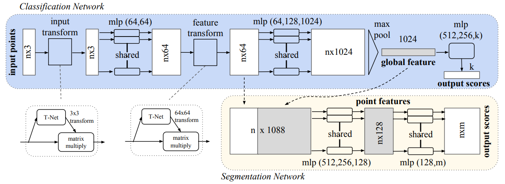

# 🗃 AI-Paper-Drawer
人工智能论文关键点概括集结。This project aims to collect key points of AI papers. 扫码加入QQ交流群 ↓

# 子抽屉
[图神经网络](图网络专区.md)

# 🗡 论文共读讨论组

# Graph

# CV
## 2017
### [【CVPR】](https://arxiv.org/abs/1612.00593) PointNet: Deep Learning on Point Sets for 3D Classification and Segmentation

- 点云分类/语义分割
- 利用核长为1的卷积对每个点单独升维后使用对称函数（本文利用MaxPooling）获取具有输入排列不变性的全局点云特征。
  - 分类：使用全连接网络对全局特征降维至类别数。
  - 语义分割：在每个升维后的点特征向量（1024维）后拼接上全局特征，再使用单一感受野的卷积降维对每个点做分类。
- T-Net：使用如上操作提取固定多个全局特征构成变换矩阵，左乘点云数据施加线性变换，增加对点云刚性变换的鲁棒性。

# NLP

# Others
