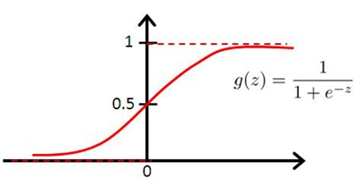
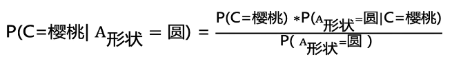
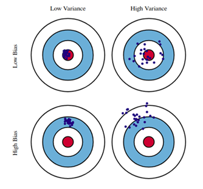

# 🗃 AI-Paper-Drawer
人工智能论文笔记，若有不当之处欢迎指正(发 issue 或 PR)。 ⛄欢迎扫码加入QQ交流群832405795 ↓

此 repo 旨在记录各 AI 论文具有启发性的核心思想和流程
- 点击论文标题前的超链接可访问原文
- 点击✒可进入流程速记页面，记录核心算法公式，便于复习

# 子抽屉
[图神经网络](图网络专区.md)

## 相关链接
- [🐍 LeetCode最短Python题解 ](https://github.com/cy69855522/Shortest-LeetCode-Python-Solutions)。
- [🚀 AI Power](https://www.aipower.xyz) 云GPU租借/出租平台：图网络的计算需要高算力支持，赶论文、拼比赛的朋友不妨了解一下~ 现在注册并绑定（参考Github）即可获得高额算力，详情请参考[AI Power指南](https://github.com/cy69855522/AI-Power)

# 💫 Graph 图网络
## 图数据
### [【2016 ICLR】](https://arxiv.org/pdf/1511.05493.pdf) [✒](sources/papers/57514455543057425140583043554145555E5355305E554542515C305E5544475F425B43BFE673402/README.md) GATED GRAPH SEQUENCE NEURAL NETWORKS
- `动机：为了使GNN能够用于处理序列问题`
- 图神经网络的一种，以每一次局部传播的结果作为输入，网络层数即传播次数固定，层与层之间的信息传递手法利用GRU的门控机制
## 点云
### [【2020 AAAI】](https://arxiv.org/abs/1912.10775) [✒](sources/papers/407F797E64225E7F74752A30537F6262757C7164797F7E305C7571627E797E77307F763054697E717D79733D5E7F747530767F6230407F797E6430537C7F65743056757164656275305D7F74757C797E771DBFE673402/README.md) Point2Node: Correlation Learning of Dynamic-Node for Point Cloud Feature Modeling
- `动机：探索自我(自身特征通道)相关性、局部相关性、非局部相关性`
- 利用`softmax`引入自身通道注意力、节点与节点间注意力。考虑节点与节点间注意力时参考“Non-Local Neural Network”做矩阵乘法构建各点间的注意力。利用门控式分权聚合代替残差连接
### [【2020 AAAI】](https://arxiv.org/abs/1912.10644v1) [✒](sources/papers/57757F7D756462693043787162797E77305E7564677F627B30767F6230235430407F797E6430537C7F657430537C716363797679737164797F7E30717E74304375777D757E647164797F7EBFE673402/README.md) Geometry Sharing Network for 3D Point Cloud Classification and Segmentation
- `动机：构建特征空间的相似连接，挖掘远距离相似结构的相关性`
- 利用局部点构成的结构矩阵的特征值作为旋转平移不变的局部特征，寻找结构相似的点作为邻居
### [【2019 ICCV】](https://arxiv.org/abs/1908.04512)  Interpolated Convolutional Networks for 3D Point Cloud Understanding
- `动机：利用插值解决点云数据结构的稀疏性、不规则性和无序性`
- 预设几个离散卷积核权重的位置，对每个中心点所对应的核权重位置进行插值并归一化，然后计算激活值
### [【2019 ICCV】](http://openaccess.thecvf.com/content_ICCV_2019/papers/Zheng_PointCloud_Saliency_Maps_ICCV_2019_paper.pdf)  PointCloud Saliency Maps
- `动机：建立点云的显著性图，评估每个点对于下游任务的重要性`
- 将某点的坐标移动到原点，计算模型性能差异作为点对于下游任务的贡献度。贡献度由`loss`对于点坐标模长`r`的偏导数决定
### [【2019 CVPR】](https://arxiv.org/abs/1811.07782) [✒](sources/papers/5D7F74757C797E77305C7F73717C3057757F7D756462797330436462657364656275307F7630235430407F797E6430537C7F657463306563797E773057757F3D535E5EBFE673402/README.md) Modeling Local Geometric Structure of 3D Point Clouds using Geo-CNN
- `动机：显式建模局部点间的几何结构`
- 将局部点云特征提取过程按三个正交基分解，然后根据边向量与基之间的夹角对提取的特征进行聚合，鼓励网络在整个特征提取层次中保持欧氏空间的几何结构
### [【2019 CVPR】](https://engineering.purdue.edu/~jshan/publications/2018/Lei%20Wang%20Graph%20Attention%20Convolution%20for%20Point%20Cloud%20Segmentation%20CVPR2019.pdf) Graph Attention Convolution for Point Cloud Segmentation
- `动机：引入注意力机制缓解图卷积各向同性问题，避免特征污染`
- 将离散卷积核设定为相对位置和特征差分的函数，并利用 `softmax` 做归一化
### [【2018 CVPR】](http://openaccess.thecvf.com/content_cvpr_2018/papers/Shen_Mining_Point_Cloud_CVPR_2018_paper.pdf) Mining Point Cloud Local Structures by Kernel Correlation and Graph Pooling
- `动机：类比卷积局部激活性到三维离散点云核相关`
- 类比卷积核对分布相近数据具有更高激活值的特点，构造可学习的图核，通过局部区域点的分布与图核的相似性计算激活值
### [【2018 CVPR】](https://arxiv.org/abs/1711.08920v2)  SplineCNN: Fast Geometric Deep Learning with Continuous B-Spline Kernels
- `动机：一个新的基于b样条的卷积算子，它使得计算时间独立于核大小`
### [【2017 CVPR】](https://arxiv.org/abs/1612.00593) ⭐ PointNet: Deep Learning on Point Sets for 3D Classification and Segmentation
- `动机：构造具有排列不变性的神经网络`
- 本文开创 DL 在无序点云上识别的先河，利用核长为1的卷积核对每个点单独升维后使用对称函数（+、max 等）获取具有输入排列不变性的全局点云特征
# 🖼 CV 计算机视觉
## 卷积演变
### [【2019 CVPR】](https://arxiv.org/abs/1904.05049v3) Drop an Octave: Reducing Spatial Redundancy in Convolutional Neural Networks with Octave Convolution
- `动机：缓解卷积层在特征图空间频率的冗余`
- 将卷积通道划分为俩个部分，高分辨率通道存储高频特征，低分辨率通道存储低频特征，提高效率

# 📜 NLP 自然语言处理
## 循环神经网络
### [【2014】](https://arxiv.org/abs/1406.1078) [✒](sources/papers/5C7571627E797E773040786271637530427560627563757E647164797F7E63306563797E7730425E5E30557E737F7475623D5475737F74756230767F6230436471647963647973717C305D717378797E75304462717E637C7164797F7EBFE673402/README.md) Learning Phrase Representations using RNN Encoder-Decoder for Statistical Machine Translation
- 提出了`GRU`，其效果与`LSTM`相近，效率更高

# 💞 Recommendation 推荐系统

# 👾 RL 强化学习

# 🎨 GANs 生成式对抗网络

# 🔘 Meta Learning 元学习

# 🚥 Cluster 聚类
## 目标函数
### [【2019 ICCV】](https://arxiv.org/abs/1807.06653v4) [✒](sources/papers/597E66716279717E6430597E767F627D7164797F7E30537C6563647562797E7730767F6230457E6365607562667963757430597D71777530537C716363797679737164797F7E30717E74304375777D757E647164797F7EBFE673402/README.md) Invariant Information Clustering for Unsupervised Image Classification and Segmentation
- `动机：提出一种新的聚类目标IIC作为端到端神经网络损失函数`
- 以一对近似样本投入神经网络获得成对的输出，最大化俩者的互信息

# ⚗ Others 其他

# 🎯 知识点速记
## 线性代数
### [✒](sources/keyPoints/AEC8C5E3BFE673402/README.md) 矩阵
- 矩阵代表一种对空间内所有点的线性变换，即线性地改变空间的标准正交基
- 线性变换：旋转、缩放
- 方阵可分解为特征值与特征向量，矩阵的变化过程可以用多个方向的缩放表示，特征值代表方向，特征值代表程度
## 评估指标
- accuracy 正确率：被分对的样本 / 所有样本
- precision 精度：分对的正样本 / 预测为正的样本
- recall 召回率（真阳性率）：分对的正样本 / 正样本，有病的被查出来的概率
- 假阳性率：分错的负样本 / 负样本，没病的被当成有病的概率
- ROC曲线：滑动归类阈值来产生关键点并连接，横坐标为`1 - 假阳性率`，纵坐标为`真阳性率`，线下面积`AUC = (1 - 假阳性率)*真阳性率`越高越好
- f1 score：`2*precision*recall / (precision + recall)`
## 优化方法
- 最小二乘法：设偏导为0求解参数
- 梯度下降：朝着损失下降最快的方向迭代
### SGD
### Adam
## 损失函数
### [✒](sources/keyPoints/53627F636330557E64627F6069BFE673402/README.md) Cross Entropy
- 交叉熵常用于分类问题，表示的是预测结果的概率分布与实际结果概率分布的差异
## 归一化
## 激活函数
### Sigmoid/Logistic

- y = 1/(1+e^(-x))
- 导数 y' = y(1-y)
## ML模型
### Logistic Regression 逻辑回归
- 以sigmoid为激活函数的单层全连接网络
### LDA 线性判别分析
- 将高维数据投影到二维进行分类，最小化投影后类内协方差，最大化投影后两个类别中心的距离
### K-Means K均值聚类
- 简单，效率高
1. 随机选择K个样本作为类心
2. 把每个样本点归类到最近的类心下
3. 重新计算每个类的均值作为新的类心
4. 重复2~3直到收敛（类心变动不大）
### Naive Bayes 朴素贝叶斯
- 根据训练集预估：已知条件B下某类A出现的概率
- 边缘概率（又称先验概率）：某一个事件的概率`P(A)`
- 联合概率：多个事件共同发生的概率`P(A∩B)`
- 条件概率（又称后验概率）：事件A在另外一个事件B已经发生条件下的发生概率`P(A|B)`
- 
- `P(A|B) = P(A∩B)/P(B) = P(A)P(B|A)/P(B)`
- 总结：
  - `P(樱桃|圆形) = P(樱桃∩圆形) / P(圆形)`
  - **已知特征B的情况下推测样本属于A的概率 = 训练集中具备特征B的样本中存在类别A的概率**
### PCA 主成分分析
### SVM 支持向量机
### Decision Tree 决策树
- ★构造决策树
  - [熵：信息量的期望 -∑Pi·ln(Pi)](sources/keyPoints/53627F636330557E64627F6069BFE673402/README.md)
  - Gini系数(和熵一样用于衡量混乱度)：`-∑Pi·(1-Pi)`
  - 决策树以特征为节点，把原本规划到不同分支的叶子上
  - 出于推理速度的考虑，决策树越矮越好，因此节点的熵降低越快越好
  - 信息增益（**添加节点**后熵减小的程度） = 节点的熵 - ∑分支概率·分支后的熵
  - ID3：以信息增益大的点作为新节点构树
  - C4.5：为了排除类似ID特征一样的干扰项（增益高，分支下样本稀缺），以信息增益率（增益/分支方式的熵）作为添加节点的依据
  - 损失函数C：叶子的熵的期望`∑Nt·H(t)`越小越好，`N`代表叶子下样本量，`H`代表熵
  - 连续值作为节点特征：区间化
- 剪枝
  - 预剪枝（控制是否继续分叉）
  1. 提前停止（限制最大深度）
  2. 最小节点样本量（小于某个阈值不再分割）
  - 后剪枝
  损失函数C'：C+α|T|，α为参数，|T|代表叶子数
- 参考：
  - [📺 B站◽决策树与随机森林](https://www.bilibili.com/video/BV1Ps411V7px?p=1)
### Ensemble 集成学习
- Bootstraping：有放回采样
- Bagging：利用Bootstraping采样多次分别构造多个同类分类器，最后进行投票。可并行。降低了模型表现的方差variance。
- Boosting：递归地构建多个同类弱分类器，每个弱分类器都修正上一次的结果。不可并行。降低了模型表现的偏差bias。
- Stacking：堆叠不同的模型
- 参考：
  - 
    靶心指的是表现最好的模型
  - [📘 知乎◽为什么说bagging是减少variance，而boosting是减少bias?](https://www.zhihu.com/question/26760839)
### Random Forest 随机森林
- 样本选择（有放回）：利用Bagging并行构造多颗决策树投票
- 特征选择（不放回）：选取部分特征
### Adaboost
- 递进地组合多个弱分类器形成一个强分类器，**每轮根据上一个基分类器的效果调整数据权重**，增加被分错的样本的权重
1. 对每个训练样本赋予相同的权重，训练第一个基分类器
2. 根据前一个基分类器的效果更新样本权重，重复此步骤多次得到多个基分类器
3. 依据基分类器的表现，对所有基分类器的预测结果加权求和
- 参考：
  - [📺 B站◽adaboost视频演示](https://www.bilibili.com/video/BV1fJ411277N?from=search&seid=1509457975916423108)
### GBDT
- 递进地组合多个弱分类器形成一个强分类器，**每轮以之前组合模型的残差（真实值-预测值）作为标签学习一个决策树**，预测残差
1. 有一个样本[数据->标签]是：[(2，4，5)-> 4]
2. 第一棵决策树用这个样本训练的预测为3.3
3. 那么第二棵决策树训练时的输入，这个样本就变成了：[(2，4，5)-> 0.7]。也就是说，下一棵决策树输入样本会与前面决策树的训练和预测相关
4. 重复引入新的树学习残差
5. 把样本通过所有树的结果相加获得最终预测值
- 以上是针对均方差损失函数。然而，对于更复杂的损失函数，比如引入了正则项，则最优目标不是让预测值完全等于真实值。此时，可以用损失函数针对
- 总结：
  - 仿照梯度下降原理，考虑：`Loss=LossFunction(之前的模型f(x))`，那么要最小化损失，现在可以引入一个新的模型g，使得`Loss=LossFunction(之前的模型f(x)+新模型g(x))`最小。
  - 根据梯度下降算法，可以让g(x)为f(x)的负梯度，通过不断迭代来逼近最小Loss，因此GBDT以f(x)的负梯度作为标签训练新的模型g
- 参考：
  - [📕 CSDN◽Adaboost、GBDT与XGBoost的区别]
  - [📘 知乎◽gbdt的残差为什么用负梯度代替？]
### XGBoost
- 类似于GBDT，区别为：
  - GBDT将LossFunction泰勒展开到一阶，而XGBoost将目标函数泰勒展开到了二阶
  - GBDT是给新的基模型寻找新的拟合标签（前面加法模型的负梯度），而XGBoost是给新的基模型寻找新的目标函数（目标函数关于新的基模型的二阶泰勒展开）。换句话说，GBDT要求新模型最终预测值拟合负梯度，而XGBoost直接利用这种要求来构建最优决策树
  - XGBoost加入了叶子权重的L2正则化项
- 参考：
  - [XGBoost原理概述 XGBoost和GBDT的区别](http://www.elecfans.com/d/995278.html)
  - [机器学习算法总结(四)——GBDT与XGBOOST](https://www.cnblogs.com/jiangxinyang/p/9248154.html)
