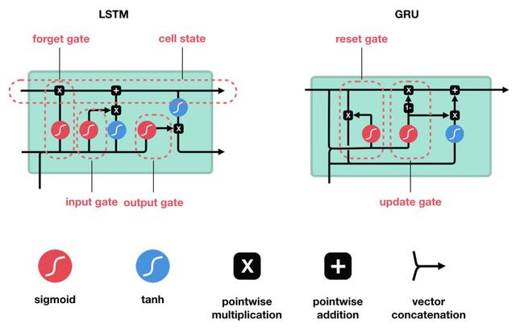

# 🗃 AI-Paper-Drawer
人工智能论文笔记，若有不当之处欢迎指正(发 issue 或 PR)。 ⛄欢迎扫码加入QQ交流群832405795 ↓


此 repo 旨在记录各 AI 论文具有启发性的核心思想和流程
- 点击论文标题前的超链接可访问原文
- 点击✒可进入流程速记页面，记录核心算法公式，便于复习

# 子抽屉
[图神经网络](图网络专区.md)

## 相关链接
- [🐍 LeetCode最短Python题解 ](https://github.com/cy69855522/Shortest-LeetCode-Python-Solutions)。
- [🚀 AI Power](https://www.aipower.xyz) 云GPU租借/出租平台：图网络的计算需要高算力支持，赶论文、拼比赛的朋友不妨了解一下~ 现在注册并绑定（参考Github）即可获得高额算力，详情请参考[AI Power指南](https://github.com/cy69855522/AI-Power)

# 💫 Graph 图网络

<details>
  <summary>点击展开折叠</summary>
	
## 图数据
### [【2016 ICLR】](https://arxiv.org/pdf/1511.05493.pdf) [✒](sources/papers/57514455543057425140583043554145555E5355305E554542515C305E5544475F425B43BFE673402/README.md) GATED GRAPH SEQUENCE NEURAL NETWORKS
- `动机：为了使GNN能够用于处理序列问题`
- 图神经网络的一种，以每一次局部传播的结果作为输入，网络层数即传播次数固定，层与层之间的信息传递手法利用GRU的门控机制
## 点云
### [【2020 AAAI】](https://arxiv.org/abs/1912.10775) [✒](sources/papers/407F797E64225E7F74752A30537F6262757C7164797F7E305C7571627E797E77307F763054697E717D79733D5E7F747530767F6230407F797E6430537C7F65743056757164656275305D7F74757C797E771DBFE673402/README.md) Point2Node: Correlation Learning of Dynamic-Node for Point Cloud Feature Modeling
- `动机：探索自我(自身特征通道)相关性、局部相关性、非局部相关性`
- 利用`softmax`引入自身通道注意力、节点与节点间注意力。考虑节点与节点间注意力时参考“Non-Local Neural Network”做矩阵乘法构建各点间的注意力。利用门控式分权聚合代替残差连接
### [【2020 AAAI】](https://arxiv.org/abs/1912.10644v1) [✒](sources/papers/57757F7D756462693043787162797E77305E7564677F627B30767F6230235430407F797E6430537C7F657430537C716363797679737164797F7E30717E74304375777D757E647164797F7EBFE673402/README.md) Geometry Sharing Network for 3D Point Cloud Classification and Segmentation
- `动机：构建特征空间的相似连接，挖掘远距离相似结构的相关性`
- 利用局部点构成的结构矩阵的特征值作为旋转平移不变的局部特征，寻找结构相似的点作为邻居
### [【2019 ICCV】](https://arxiv.org/abs/1908.04512) [](sources/papers/597E647562607F7C7164757430537F7E667F7C6564797F7E717C305E7564677F627B6330767F6230235430407F797E6430537C7F657430457E7475626364717E74797E77BFE673402/README.md) Interpolated Convolutional Networks for 3D Point Cloud Understanding
- `动机：利用插值解决点云数据结构的稀疏性、不规则性和无序性`
- 预设几个离散卷积核权重的位置，对每个中心点所对应的核权重位置进行插值并归一化，然后计算激活值
### [【2019 ICCV】](http://openaccess.thecvf.com/content_ICCV_2019/papers/Zheng_PointCloud_Saliency_Maps_ICCV_2019_paper.pdf) [](sources/papers/407F797E64537C7F65743043717C79757E7369305D716063BFE673402/README.md) PointCloud Saliency Maps
- `动机：建立点云的显著性图，评估每个点对于下游任务的重要性`
- 将某点的坐标移动到原点，计算模型性能差异作为点对于下游任务的贡献度。贡献度由`loss`对于点坐标模长`r`的偏导数决定
### [【2019 CVPR】](https://arxiv.org/abs/1811.07782) [✒](sources/papers/5D7F74757C797E77305C7F73717C3057757F7D756462797330436462657364656275307F7630235430407F797E6430537C7F657463306563797E773057757F3D535E5EBFE673402/README.md) Modeling Local Geometric Structure of 3D Point Clouds using Geo-CNN
- `动机：显式建模局部点间的几何结构`
- 将局部点云特征提取过程按三个正交基分解，然后根据边向量与基之间的夹角对提取的特征进行聚合，鼓励网络在整个特征提取层次中保持欧氏空间的几何结构
### [【2019 CVPR】](https://engineering.purdue.edu/~jshan/publications/2018/Lei%20Wang%20Graph%20Attention%20Convolution%20for%20Point%20Cloud%20Segmentation%20CVPR2019.pdf) Graph Attention Convolution for Point Cloud Segmentation
- `动机：引入注意力机制缓解图卷积各向同性问题，避免特征污染`
- 将离散卷积核设定为相对位置和特征差分的函数，并利用 `softmax` 做归一化
### [【2018 CVPR】](http://openaccess.thecvf.com/content_cvpr_2018/papers/Shen_Mining_Point_Cloud_CVPR_2018_paper.pdf) Mining Point Cloud Local Structures by Kernel Correlation and Graph Pooling
- `动机：类比卷积局部激活性到三维离散点云核相关`
- 类比卷积核对分布相近数据具有更高激活值的特点，构造可学习的图核，通过局部区域点的分布与图核的相似性计算激活值
### [【2018 CVPR】](https://arxiv.org/abs/1711.08920v2) [](sources/papers/43607C797E75535E5E2A30567163643057757F7D75646279733054757560305C7571627E797E77306779647830537F7E64797E657F656330523D43607C797E75305B75627E757C63BFE673402/README.md) SplineCNN: Fast Geometric Deep Learning with Continuous B-Spline Kernels
- `动机：一个新的基于b样条的卷积算子，它使得计算时间独立于核大小`
### [【2017 CVPR】](https://arxiv.org/abs/1612.00593) ⭐ PointNet: Deep Learning on Point Sets for 3D Classification and Segmentation
- `动机：构造具有排列不变性的神经网络`
- 本文开创 DL 在无序点云上识别的先河，利用核长为1的卷积核对每个点单独升维后使用对称函数（+、max 等）获取具有输入排列不变性的全局点云特征

</details>

# 🖼 CV 计算机视觉

<details>
  <summary>点击展开折叠</summary>
	
## 卷积演变
### [【2019 CVPR】](https://arxiv.org/abs/1904.05049v3) Drop an Octave: Reducing Spatial Redundancy in Convolutional Neural Networks with Octave Convolution
- `动机：缓解卷积层在特征图空间频率的冗余`
- 将卷积通道划分为俩个部分，高分辨率通道存储高频特征，低分辨率通道存储低频特征，提高效率

</details>

# 📜 NLP 自然语言处理

<details>
  <summary>点击展开折叠</summary>
	
## 循环神经网络
### [【2014】](https://arxiv.org/abs/1406.1078) [✒](sources/papers/5C7571627E797E773040786271637530427560627563757E647164797F7E63306563797E7730425E5E30557E737F7475623D5475737F74756230767F6230436471647963647973717C305D717378797E75304462717E637C7164797F7EBFE673402/README.md) Learning Phrase Representations using RNN Encoder-Decoder for Statistical Machine Translation
- 提出了`GRU`，其效果与`LSTM`相近，效率更高

</details>

# 💞 Recommendation 推荐系统

# 👾 RL 强化学习

# 🎨 GANs 生成式对抗网络

# 🔘 Meta Learning 元学习

# 🚥 Cluster 聚类

<details>
  <summary>点击展开折叠</summary>
	
## 目标函数
### [【2019 ICCV】](https://arxiv.org/abs/1807.06653v4) [✒](sources/papers/597E66716279717E6430597E767F627D7164797F7E30537C6563647562797E7730767F6230457E6365607562667963757430597D71777530537C716363797679737164797F7E30717E74304375777D757E647164797F7EBFE673402/README.md) Invariant Information Clustering for Unsupervised Image Classification and Segmentation
- `动机：提出一种新的聚类目标IIC作为端到端神经网络损失函数`
- 以一对近似样本投入神经网络获得成对的输出，最大化俩者的互信息

</details>

# ⚗ Others 其他

# 🎯 知识点速记
## 数据结构

<details>
  <summary>点击展开折叠</summary>
	
### 堆
- 二叉树结构，被用于实现**优先队列**
- 最小的数在最上面，子结点必定大于父结点
- 添加数据时加到最后一行从左往右添加，取出数据时拿走树顶的数并把最后一个（最后一行最右边一个）放在顶点处进行维护
- 添加/提取的时间复杂度都为`O(logN)`
### 二叉查找树
- 我们可以把二叉查找树当作是**二分查找**算法思想的树形结构体现
- 每个结点的值均大于其左子树上任意一个结点的值，小于其右子树上任意一个结点的值
- 删除节点后，在被删除结点的左子树中寻找最大结点放上去，如果需要移动的结点还有子结点，就递归执行前面的操作
- 平衡时时间复杂度为`o(logN)`，最坏情况下`O(N)`

</details>

## 排序

<details>
  <summary>点击展开折叠</summary>
	
### 冒泡排序
- 重复“从序列右边开始比较相邻两个数字的大小，再根据结果交换两个数字的位置”，每次迭代都把最小的数字移动到最左边
- 时间复杂度：`O(N^2)`
### 选择排序
- 执行N次不放回地取最小值操作
- 时间复杂度：`O(N^2)`
### 插入排序
- 把右侧未排序的数逐个插入到左侧已经排好的区域
- 时间复杂度：`O(N^2)`
### 堆排序
- 把数据存进堆，然后从堆顶逐个取出
- 时间复杂度：`O(NlogN)`
### 归并排序
- 把数据递归地对半分，分到不能分的时候对半组合并排序
- 时间复杂度：`O(NlogN)`，将长度为`N`的序列对半分割直到只有一个数据为止时，可以分成`log2(N)`行，每行排序耗费`N`次比较。也就是说，总的运行时间为 O(NlogN)
- ```python
  def merge(num: list):
    if len(num) < 1: return num
    a = []
    a1, a2 = merge(num[:(half:=len(num)//2)]), merge(num[half:])
    while a1 and a2:
        if a1[0] > a2[0]: a1, a2 = a2, a1
        a.append(a1[0])
        a1 = a1[1:]
    return a + a1 + a2
  ```
### 快速排序
- 选择一个基准值`m`，然后把数据划分为比`m`小和不小于`m`的俩个部分。递归这两个部分，最后整个数组就是从小到大了
- 时间复杂度：平均`O(NlogN)`，最差情况（每次m都选到极端数字，需要递归O(N)次）`O(N^2)`
- ```python
  def quick(num: list):
    if len(num) < 1: return num
    m, num = num[0], num[1:]
    l = quick([n for n in num if n < m])
    r = quick([n for n in num if n >= m])
    return l + [m] + r
  ```

</details>

## 数组查找

<details>
  <summary>点击展开折叠</summary>
	
### 二分查找
- 需要数组已经排好序
- 每次都对比中间值，进而缩小一半的搜索范围
- 时间复杂度为：`logN`

</details>

## 图的搜索

<details>
  <summary>点击展开折叠</summary>
	
### 最小生成树
- 边权和最小的生成树（无环，但连接了所有节点）
- Kruskal
  - 对所有边进行排序
  - 按权的顺序来添加边（已经连通的点不需要）
- Prim
  - 随便选一点加入点集
  - 选择距离点集最近的点加入点集
### 广度优先 BFS
- 广度优先搜索(BFS)是一种对图进行搜索的算法。BFS会优先从离起点近的顶点开始搜索，这样由近及广。根据BFS的特性，其常常被用于 `遍历` 和 `搜索最短路径`
- BFS一般流程：
	```python
	class Solution(object):
	    def BFS(self):
		# 1.使用 queue.Queue 初始化队列 q = Queue()
		# 2.选择合适的根节点压入队列

		# 3.使用 wile 进入队列循环，直到搜索完毕 while not q.empty():
		# {
		#   4.取出一个节点 q.get()
		#   5.放入这个节点周围的节点 q.put()
		# }
	```
	- 使用 BFS 时，需要抓住 3 个关键点：根节点是什么？根节点的一阶邻域节点是哪些？什么时候停止搜索？
### 深度优先 DFS
- 深度优先搜索会沿着一条路径不断往下搜索直到不能再继续为止，然后再折返，开始搜索下一条候补路径。
- DFS一般流程类似于BFS，但是用栈而不是队列

</details>

## 微积分

<details>
  <summary>点击展开折叠</summary>
	
### 链式法则
- `f(g(x))' = f'g'`
- `f(g(x),z(x))' = f'g' + f'z'`
- 参考：
  - [📘 知乎◽深度学习数学基础之链式法则](https://zhuanlan.zhihu.com/p/113112455)

</details>

## 线性代数

<details>
  <summary>点击展开折叠</summary>
	
### [✒](sources/keyPoints/AEC8C5E3BFE673402/README.md) 矩阵
- 矩阵代表一种对空间内所有点的线性变换，即线性地改变空间的标准正交基
- 线性变换：旋转、缩放
- 方阵可分解为特征值与特征向量，矩阵的变化过程可以用多个方向的缩放表示，特征值代表方向，特征值代表程度

</details>

## 概率论

<details>
  <summary>点击展开折叠</summary>
	
### 极大似然估计
- ∏p（联合概率/所有样本都被正确分类的概率）
- 选取候选参数中使得所有样本被正确分类的概率最大的参数
- 损失函数：最大化所有样本正确类别概率的乘积就可以反向寻找最优参数

</details>

## 评估指标

<details>
  <summary>点击展开折叠</summary>
	
- accuracy 正确率：被分对的样本 / 所有样本
- precision 精度：分对的正样本 / 预测为正的样本
- recall 召回率（真阳性率）：分对的正样本 / 正样本，有病的被查出来的概率
- 假阳性率：分错的负样本 / 负样本，没病的被当成有病的概率
- ROC曲线：滑动归类阈值来产生关键点并连接，横坐标为`1 - 假阳性率`，纵坐标为`真阳性率`，线下面积`AUC = (1 - 假阳性率)*真阳性率`越高越好
- f1 score：`2*precision*recall / (precision + recall)`

</details>

## 优化方法

<details>
  <summary>点击展开折叠</summary>
	
- 最小二乘法：设偏导为0求解参数
- 梯度下降：朝着损失下降最快的方向迭代
- Sinkhorn（最优分配）：分配优化方法
	- 条件：给出代价矩阵M(n×m)表示n个用户各自对m种小吃的厌恶程度，向量r表示每个人的需求量，向量c表示每种小吃的数量
	- 目标：找到总体满意度最高的分配方法，
	- 参考：[📕 CSDN◽Sinkhorn算法](https://blog.csdn.net/zsfcg/article/details/112510577)
### SGD
### Adam
## 损失函数
### [✒](sources/keyPoints/53627F636330557E64627F6069BFE673402/README.md) Cross Entropy
- 交叉熵常用于分类问题，表示的是预测结果的概率分布与实际结果概率分布的差异
## 归一化
## 激活函数
### Sigmoid/Logistic

- y = 1/(1+e^(-x))
- 导数 y' = y(1-y)

</details>

## ML模型

<details>
  <summary>点击展开折叠</summary>
	
### Logistic Regression 逻辑回归
- 以sigmoid为激活函数的单层全连接网络
### LDA 线性判别分析
- 将高维数据投影到二维进行分类，最小化投影后类内协方差，最大化投影后两个类别中心的距离
### K-Means K均值聚类
- 简单，效率高
1. 随机选择K个样本作为类心
2. 把每个样本点归类到最近的类心下
3. 重新计算每个类的均值作为新的类心
4. 重复2~3直到收敛（类心变动不大）
### Naive Bayes 朴素贝叶斯
- 根据训练集预估：已知条件B下某类A出现的概率
- 边缘概率（又称先验概率）：某一个事件的概率`P(A)`
- 联合概率：多个事件共同发生的概率`P(A∩B)`
- 条件概率（又称后验概率）：事件A在另外一个事件B已经发生条件下的发生概率`P(A|B)`
- 
- `P(A|B) = P(A∩B)/P(B) = P(A)P(B|A)/P(B)`
- 总结：
  - `P(樱桃|圆形) = P(樱桃∩圆形) / P(圆形)`
  - **已知特征B的情况下推测样本属于A的概率 = 训练集中具备特征B的样本中存在类别A的概率**
### PCA 主成分分析
- 假设均值为0
- 朝着方差最大的基降维，不同基之间正交，基的个数即降维后数据维数
- 理解：
  - 设输入为矩阵`M`，形状`N×3`，`N`代表样本个数，`3`是特征通道数
  - `C = M^T × M`，`C`为协方差矩阵
  - **PCA要找到一个变换矩阵`Q`，使得`MQ`的协方差矩阵成为一个对角阵。此时对角线上的方差有数值，而其余的协方差为0（降维后基正交）。**
  - 因此新的协方差矩阵`C' = (MQ)^T × MQ = Q^T M^T M Q = Q^T C Q = λ`，同特征分解
  - 为了尽可能保留数据特征，PCA希望在新的基上数据分散一些（方差大），故选择特征值大的特征向量作为`Q`
- 参考：
  - [📺 B站◽22降维算法-PCA主成分分析](https://www.bilibili.com/video/BV1PJ411G74g?p=1)
### SVM 支持向量机
- 使得距离边界最近的点到边界的距离尽量大（Margin）
### Decision Tree 决策树
- ★构造决策树
  - [熵：信息量的期望 -∑Pi·ln(Pi)](sources/keyPoints/53627F636330557E64627F6069BFE673402/README.md)
  - Gini系数(和熵一样用于衡量混乱度)：`-∑Pi·(1-Pi)`
  - 决策树以特征为节点，把原本规划到不同分支的叶子上
  - 出于推理速度的考虑，决策树越矮越好，因此节点的熵降低越快越好
  - 信息增益（**添加节点**后熵减小的程度） = 节点的熵 - ∑分支概率·分支后的熵
  - ID3：以信息增益大的点作为新节点构树
  - C4.5：为了排除类似ID特征一样的干扰项（增益高，分支下样本稀缺），以信息增益率（增益/分支方式的熵）作为添加节点的依据
  - 损失函数C：叶子的熵的期望`∑Nt·H(t)`越小越好，`N`代表叶子下样本量，`H`代表熵
  - 连续值作为节点特征：区间化
- 剪枝
  - 预剪枝（控制是否继续分叉）
  1. 提前停止（限制最大深度）
  2. 最小节点样本量（小于某个阈值不再分割）
  - 后剪枝
  损失函数C'：C+α|T|，α为参数，|T|代表叶子数
- 参考：
  - [📺 B站◽决策树与随机森林](https://www.bilibili.com/video/BV1Ps411V7px?p=1)
### Ensemble 集成学习
- Bootstraping：有放回采样
- Bagging：利用Bootstraping采样多次分别构造多个同类分类器，最后进行投票。可并行。降低了模型表现的方差variance。
- Boosting：递归地构建多个同类弱分类器，每个弱分类器都修正上一次的结果。不可并行。降低了模型表现的偏差bias。
- Stacking：堆叠不同的模型
- 参考：
  - 
    靶心指的是表现最好的模型
  - [📘 知乎◽为什么说bagging是减少variance，而boosting是减少bias?](https://www.zhihu.com/question/26760839)
### Random Forest 随机森林
- 样本选择（有放回）：利用Bagging并行构造多颗决策树投票
- 特征选择（不放回）：选取部分特征
### Adaboost
- 递进地组合多个弱分类器形成一个强分类器，**每轮根据上一个基分类器的效果调整数据权重**，增加被分错的样本的权重
1. 对每个训练样本赋予相同的权重，训练第一个基分类器
2. 根据前一个基分类器的效果更新样本权重，重复此步骤多次得到多个基分类器
3. 依据基分类器的表现，对所有基分类器的预测结果加权求和
- 参考：
  - [📺 B站◽adaboost视频演示](https://www.bilibili.com/video/BV1fJ411277N?from=search&seid=1509457975916423108)
### GBDT
- 递进地组合多个弱分类器形成一个强分类器，**每轮以之前组合模型的残差（真实值-预测值）作为标签学习一个决策树**，预测残差
1. 有一个样本[数据->标签]是：[(2，4，5)-> 4]
2. 第一棵决策树用这个样本训练的预测为3.3
3. 那么第二棵决策树训练时的输入，这个样本就变成了：[(2，4，5)-> 0.7]。也就是说，下一棵决策树输入样本会与前面决策树的训练和预测相关
4. 重复引入新的树学习残差
5. 把样本通过所有树的结果相加获得最终预测值
- 以上是针对均方差损失函数。然而，对于更复杂的损失函数，比如引入了正则项，则最优目标不是让预测值完全等于真实值。此时，可以用损失函数针对
- 总结：
  - 仿照梯度下降原理，考虑：`Loss=LossFunction(之前的模型f(x))`，那么要最小化损失，现在可以引入一个新的模型g，使得`Loss=LossFunction(之前的模型f(x)+新模型g(x))`最小。
  - 根据梯度下降算法，可以让g(x)为f(x)的负梯度，通过不断迭代来逼近最小Loss，因此GBDT以f(x)的负梯度作为标签训练新的模型g
- 参考：
  - [📕 CSDN◽Adaboost、GBDT与XGBoost的区别](https://blog.csdn.net/hellozhxy/article/details/82143554)
  - [📘 知乎◽gbdt的残差为什么用负梯度代替？](https://www.zhihu.com/question/63560633/answer/581670747)
### XGBoost
- 类似于GBDT，区别为：
  - GBDT将LossFunction泰勒展开到一阶，而XGBoost将目标函数泰勒展开到了二阶
  - GBDT是给新的基模型寻找新的拟合标签（前面加法模型的负梯度），而XGBoost是给新的基模型寻找新的目标函数（目标函数关于新的基模型的二阶泰勒展开）。换句话说，GBDT要求新模型最终预测值拟合负梯度，而XGBoost直接利用这种要求来构建最优决策树
  - XGBoost加入了叶子权重的L2正则化项
- 参考：
  - [XGBoost原理概述 XGBoost和GBDT的区别](http://www.elecfans.com/d/995278.html)
  - [机器学习算法总结(四)——GBDT与XGBOOST](https://www.cnblogs.com/jiangxinyang/p/9248154.html)
### RANSAC 随机一致性采样
- RANSAC主要解决样本中的外点问题，最多可处理50%的外点情况
- RANSAC通过反复选择数据中的一组随机子集来达成目标。被选取的子集被假设为局内点，并用下述方法进行验证：
	1. 有一个模型适用于假设的局内点，即所有的未知参数都能从假设的局内点计算得出。
	2. 用1中得到的模型去测试所有的其它数据，如果某个点适用于估计的模型，认为它也是局内点。
	3. 如果有足够多的点被归类为假设的局内点，那么估计的模型就足够合理。
	4. 然后，用所有假设的局内点去重新估计模型，因为它仅仅被初始的假设局内点估计过。
	5. 最后，通过估计局内点与模型的错误率来评估模型。
- 这个过程被重复执行固定的次数，每次产生的模型要么因为局内点太少而被舍弃，要么因为它比现有的模型更好而被选用。
- 参考：[📘 知乎◽计算机视觉基本原理——RANSAC](https://zhuanlan.zhihu.com/p/45532306)
### 单应估计
- 求解同构图的投影变换（单应性变换）矩阵
- 参考：[📘 知乎◽单应性Homograph估计：从传统算法到深度学习](https://zhuanlan.zhihu.com/p/74597564)
### SIFT
- 方向估计：基于图像局部的梯度方向，分配给每个关键点位置一个或多个方向
- 尺度不变：获得多尺度特征序列，提取轮廓作为尺度不变特征特征
### NMS
- 抑制重复的置信度不高的候选框
- 对于同类别且重叠的框进行排序。从置信度最大的框开始，计算其他框和它的IOU，超过一定阈值就删除。按顺序执行完所有候选框

</destails>

## 深度学习

<details>
  <summary>点击展开折叠</summary>
	
- 为方便表示，`σ`为激活函数，`S^t`为t时隐状态，X为输入，Y为输出
### RNN
- `S^t = σ(W1·X^t + W2·S^(t-1))`
- `Y^t = σ(W3·S^t)`
- 梯度问题：
  - `S^t = σ(W1·X^t + W2·σ(W1·X^(t-1) + W2·σ(W1·X^(t-2) + W2·...))`
  - 根据[链式法则](链式法则)，W的梯度可以分解为多个时间步上梯度的累和，越远的时间步梯度需要连乘越多次W2σ'。连乘相同W多次，W过小容易导致梯度弥散，过大容易导致梯度爆炸
### LSTM

- 拼接`H^(t-1)`和`X`生成细胞状态`C^~`和三个门，遗忘门过滤`C^(t-1)`，输入门过滤`C^~`，输出门过滤新的细胞状态`C^t = tanh(过滤后的C^(t-1) + 过滤后的C^~)`来生成隐向量`H^t`
- `input_gate = sigmoid(W3·X^t + W4·H^(t-1))`
- `C^~ = tanh(W5·X^t + W6·H^(t-1))`
- `forget_gate = sigmoid(W1·X^t + W2·H^(t-1))`
- `C^t = forget_gate ⊙ C^(t-1) + input_gate ⊙ C^~`
- `output_gate = sigmoid(W7·X^t + W8·H^(t-1))`
- `H^t = output_gate ⊙ tanh(C^t)`
- 与RNN的核心不同：
  - `C^~`就是RNN中的`State`，相当于把`State`做了个门控式的残差连接
  - 对`C^t`也做了一个门控来生成最后的输出`H^t`
### GRU [✒](sources/papers/5C7571627E797E773040786271637530427560627563757E647164797F7E63306563797E7730425E5E30557E737F7475623D5475737F74756230767F6230436471647963647973717C305D717378797E75304462717E637C7164797F7EBFE673402/README.md)
- 拼接`H^(t-1)`和`X`生成隐状态`H^~`和俩个门，重置门在生成隐状态`H^~`时过滤上一次的隐状态`H^(t-1)`，更新门控制隐状态的残差连接，连接后直接作为新的隐向量
- `reset_gate = sigmoid(W1·X^t + W2·H^(t-1))`
- `H^~ = tanh(W3·X^t + reset_gate ⊙ W4·H^(t-1))`
- `update_gate = sigmoid(W5·X^t + W6·H^(t-1))`
- `H^t = (1 - update_gate) ⊙ H^(t-1) + update_gate ⊙ H^~`
- 与RNN的核心不同：
  - `H^~`就是RNN中的`State`，生成`State`时对`H^(t-1)`做了一个门控，同LSTM做了一个残差连接
  - 隐状态直接作为输出
- 与LSTM的核心不同：
  - 做残差的时候用更新门代替了输入门和遗忘门
  - 把输出门提前了作为上一次状态的过滤
### Transformer
### 模块
#### Upsampling 上采样
- 线性插值
- 转置卷积：对输入的每个像素点周围添加空洞来卷积
- Pixel Shuffle 子像素卷积：多做几次卷积，把通道在分辨率空间上拼在一起

</details>
