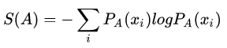
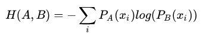

# Cross Entropy

## 背景
- 交叉熵常用于分类问题，表示的是预测结果的概率分布与实际结果概率分布的差异
## 模块流程
熵：
- `A`代表真实情况
- `PA(xi)`代表真实情况下样本属于类别`i`的概率
- `-logPA(xi)`可以视为真实情况下样本属于类别`i`时的信息量，就是样本属于`i`时让人惊讶的程度。如果样本属于`i`的概率越小，那么当样本属于`i`时就越让人惊讶。所以信息量与概率成反相关
  -  此时`概率 ∈ [0, 1]`，`信息量 ∈ [0, +∞]`，且函数单调递减。
- `S(A)`代表真实情况下概率分布的熵，也就是**各个类别信息量的期望**

KL散度：
- `B`代表模型预测的情况
- KL散度可以度量俩个分布之间的差异，具有以下性质
  - KL散度 >= 0, 当且仅当`A == B`的时候为`0`。证明可参考[这篇博客](https://blog.csdn.net/ACdreamers/article/details/44657745)
  - KL散度越大，俩种分布的差距越大
- 最小化KL散度，就可以让模型预测的概率分布接近真实的概率分布

交叉熵：
- KL散度 = `A`的熵 + 交叉熵
- 由于分类时实际分布(One Hot)的熵是固定的，最小化KL散度等效于最小化交叉熵
- KL散度可以看作两个分布的**信息量差值在以A概率为权重的情况下的期望**
- 交叉熵可以看作****
## 要点记录
- 模型预测的误差越大，使用交叉熵所获得的梯度就越大，损失下降得越快。当误差小的时候，权重的更新就慢。这是一个很好的性质，有助于模型收敛。
## 参考
- [CSDN 相对熵（KL散度）](https://blog.csdn.net/ACdreamers/article/details/44657745)
- [CSDN 一文搞懂交叉熵在机器学习中的使用，透彻理解交叉熵背后的直觉](https://blog.csdn.net/tsyccnh/article/details/79163834)
