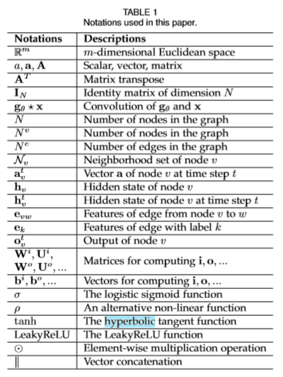
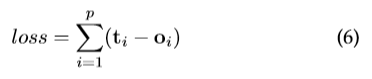
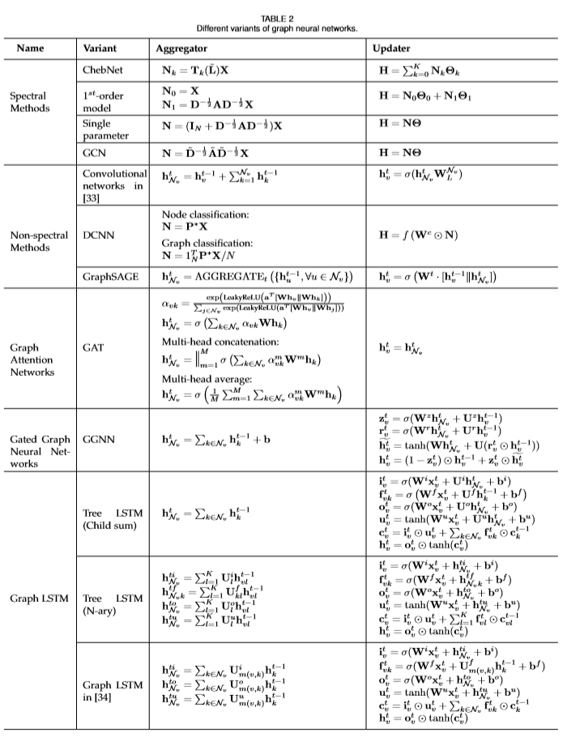
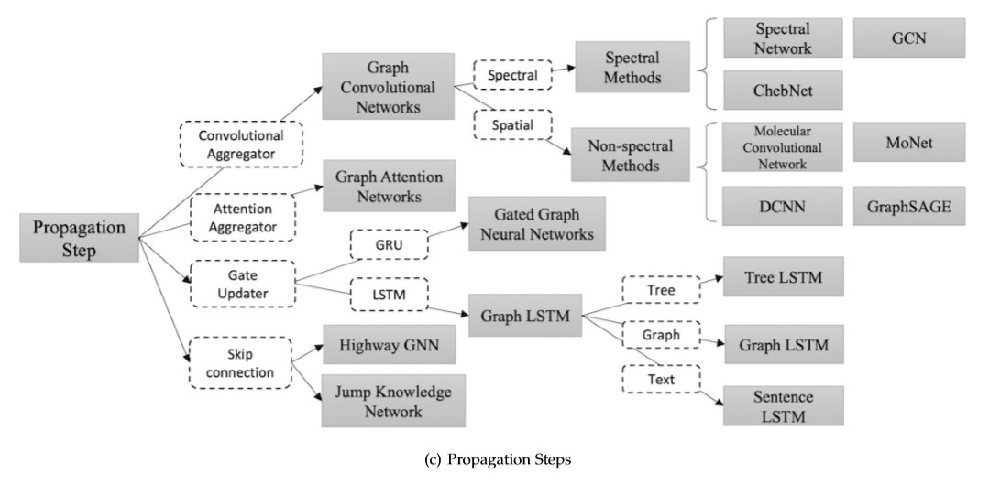
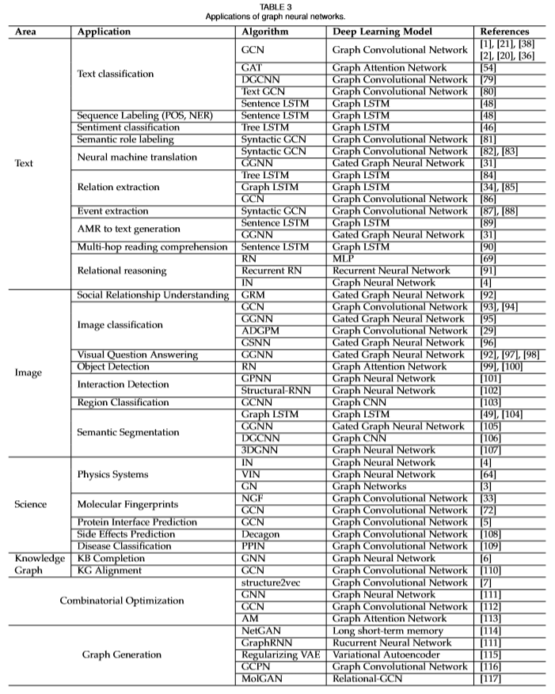

# [Graph Neural Networks: A Review of Methods and Applications](https://arxiv.org/pdf/1812.08434.pdf)
图神经网络:方法与应用综述
## 符号表

## 要点记录
- 卷积神经网络（CNN）是GNN起源的首要动机，CNN只能应用于常规的欧几里得数据上（例如2-D的图片、1-D的文本），这些形式的数据可以被看成是图的实例化。随着对GNN和CNN的深入分析，发现其有三个共同的特点：（1）局部连接（2）权值共享（3）多层网络。这对于GNN来说同样有重要的意义。（1）局部连接是图的最基本的表现形式。（2）权值共享可以减少网络的计算量。（3）多层结构可以让网络捕获不同的特征。然而，从CNN到GNN的转变还面临着另一个问题，难以定义局部卷积核和池化操作。
- 图嵌入（DeepWalk、RandomWalk等）存在两个缺点：（1）图中节点之间不存在任何的参数共享，导致计算量与节点数量呈线性增长。（2）图嵌入技术缺乏泛化能力，导致不能处理动态图或推广至新的图。
- 原始 GNN
  - 在图中，每个节点的定义是由该节点的特征和相关节点来共同表示的。GNN的目标是训练出一个state embedding函数hv，该函数包含了每个节点的领域信息。`hv = f(xv,xco[v],hne[v],xne[v]) （1）` hv是节点v的向量化表示，它可以被用来去预测该节点的输出ov（例如节点的标签）。`f（*）`被称为local transition function，它被所有的节点共享，并根据输入的领域信息来更新节点的状态。xv是节点v的特征表示，xco[v]是v节点上边的特征表示，hne[v]是该节点的状态，xne[v] 是节点v周围节点的特征表示。
  - `ov = g(hv,xv) (2) `中`g（*）`被称为local output function，它是用来产生节点的输出的。
  - `H = F(H,X) (3)    O = G(H,XN) (4) `H、O、X、XN为其推广形式，代表图中的所有对象的堆叠形式。
  - Banach的fixed point提出以后，GNN中state的迭代计算过程可以表示为：`Ht+1 = F(Ht,X) (5) `Ht代表H的第t次迭代的状态，H（0）代表其动态方程的初始状态。
  -  对于一个GNN网络来说，其训练过程就是学习出函数`f（*）`和`g（*）`，tv代表节点v的标签，GNN的优化过程为：
  - Limitations：实验结果表明GNN对于结构化数据的建模十分有效，但仍然存在着诸多的不足。
    a. 对于不动点隐藏状态的更新是十分低效的。如果放松对不动点的假设，论文中提出一种多层GNN可以得到节点及其邻域的稳定表示。
    b. GNN在迭代的过程中用相同的参数，然而大多标准网络在不同的网络层数使用不同的参数，
    c. 在原始的GNN中存在着一些无法有效建模的边缘信息特征。例如，在知识图谱中边代表这关系类型，不同边缘的消息传递应该根据他们的类型有所不同。怎么样去学习边缘的隐藏状态也是一个重要的问题。
    d. 如果把重点放在节点的表示而不是图上，就不适合使用不动点，因为不动点上表示的分布会变得非常平滑，且每个节点的信息量也会减少。
- 在模型中，信息的传播步骤和输出步骤是获得节点或者边隐含状态的关键步骤。不同变种的GNN的聚合函数（用来聚合图中所有点的邻域信息，产生一个全局性的输出）和节点状态更新函数如下图所示：
  - Convolution：GCN将卷积操作应用到图结构的数据上，主要分为Spectral method 和 Spatial Method 两种方法。其目的都是对节点以及节点的邻近节点进行信息收集。
  - Gate：使用GRU或者是LSTM这种带有门控机制的网络，来增强信息在图结构中的长期的传播。
  - Attention：GAT是一种图注意网络，它将注意力机制融入到了图传播的步骤中。GAT计算每个节点的隐藏状态，通过将 “attention” 机制应用到邻近节点上。
  - Skip connection：研究发现更深的网络层数可以帮助网络在节点的邻域节点上获取到更多的信息。但通过实验也发现深层网络也会在网络传播中带来噪声信息，随着网络层数的加深，网络还会出现退化。基于图像领域的启发，residual network和highway network 这些skip 模型能够有效的处理这一问题。
  
- 图网络被广泛的应用于包括监督学习、半监督学习、无监督学习和强化学习等方向。论文中从三个不同的场景来分别阐述图网络的应用。（1）结构化场景：数据包含有很明确的关系结构，如物理系统、分子结构和知识图谱。（2）非结构化场景：数据不包含明确的关系结构，例如文本和图像等领域。（3）其他应用场景：例如生成式模型和组合优化模型。各个领域图网络的应用细节如下图所示： 

## 参考
- [博客译文](https://blog.csdn.net/m0_38031488/article/details/88414320)
- [Banach不动点定理](https://zhuanlan.zhihu.com/p/33885648)
## 提问
1. 如何通俗易懂地解释Banach不动点定理？它和GNN迭代过程有什么关系？
