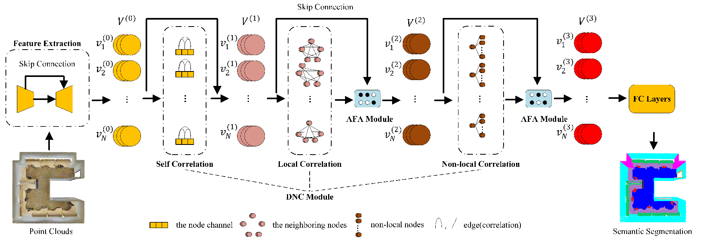
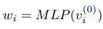
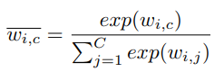
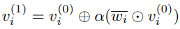
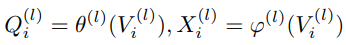
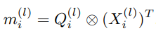
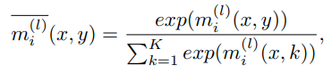
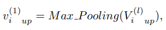

# [Point2Node: Correlation Learning of Dynamic-Node for Point Cloud Feature Modeling](https://arxiv.org/abs/1912.10775)

## 背景
- 探索点云节点的自通道相关、局部相关、非局部相关信息
## 模型流程

- 首先采用`U-Net`结构的`X-Conv`作为`Feature Extraction`层提取每个点的高级表征`V^0`
- Dynamic Node Correlation (DNC) 模块获取节点的自相关、局部相关、非局部相关信息
- Adaptive Feature Aggregation (AFA) 自适应地聚合每个节点的特征
- 全连接分类器
### 自相关

- `y = x + a(x * softmax(MLP(x))) = x(1 + a * softmax(MLP(x)))`，利用`softmax`和`MLP`获得每个通道的权重（所有权重和为1），利用权重对每个通道进行缩放，可学习参数`a`控制缩放比例
### 局部相关

- 
### 非局部相关
### 自适应特征聚合
## 要点记录
### What
1. 
### How
1.
### Why
1.
### Result
- 
### Drawbacks
- 
## 参考
- 
## 提问
1. 
