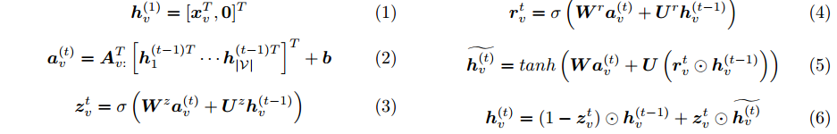

# [GATED GRAPH SEQUENCE NEURAL NETWORKS](https://arxiv.org/pdf/1511.05493.pdf)

## 背景
## 模型流程

- 考虑输入为一个有向图
- 1）对于每个节点，以它的初始值`x_v`作为`GRU`的初始隐向量`h_v`，如果`x_v`的维度小于预定义的`h_v`维度则在后面补`0`
- 2）进行一次局部传播，把入边和出边所连接到的局部领域信息聚合到中心节点作为`当前时间步GRU单元`的输入
- 3/4/5/6）GRU单元计算
## 要点记录
## 参考
- [CSDN 论文笔记：GGNN (门控图神经网络)](https://blog.csdn.net/lthirdonel/article/details/89286522)
