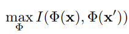
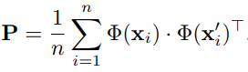
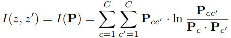
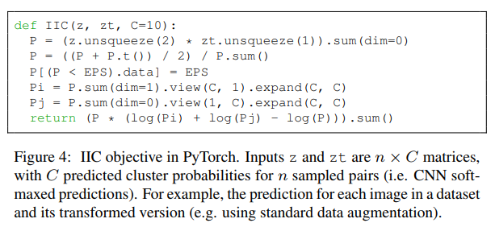

# [Invariant Information Clustering for Unsupervised Image Classification and Segmentation](https://arxiv.org/abs/1807.06653v4)

## 背景
- 本文主要提出一种成对损失函数，用于孪生网络进行聚类，最大化相邻样本的互信息
## IIC损失公式

- 设`Φ`为神经网络，同时通过两个近似输入`x`和`x'`，目标为最大化俩者的互信息


- `I(z, z') = H(z) − H(z|z')`，互信息就是一个联合分布中的两个信息的纠缠程度/或者叫相互影响那部分的信息量。最大化`H(z)`有利于分散各个类心，避免全部都归为一类。最小化`H(z|z')`引导相似样本获得相似的类别概率分布


- 作者假定`(z, z')`和`(z', z)`所对应的条件信息熵应该对称，所以计算条件信息熵时对联合概率分布`P_cc'`施加对称函数使得`P_cc' = P_c'c = (P_cc' + P_c'c) / 2`


```python
def IIC(z, zt, C=10): # z[N, C] zt[N, C]
  P = (z.unsqueeze(2) * zt.unsqueeze(1)).sum(dim=0) # [C, C]
  P = ((P + P.t()) / 2) / P.sum() # [C, C]
  P[(P < EPS).data] = EPS
  Pi = P.sum(dim=1).view(C, 1).expand(C, C)
  Pj = P.sum(dim=0).view(1, C).expand(C, C)
  return (P * (log(Pi) + log(Pj) - log(P))).sum()
```
- Pytorch代码
## 要点记录
- `x'`可以为`x`经过数据增强后的结果，在语义分割中，`x`为某一局部感受野范围的中心像素及分类的最小单位，`x'`也可以是`x`的临近像素

## 参考
- [CSDN 【机器学习】信息量，信息熵，交叉熵，KL散度和互信息（信息增益）](https://blog.csdn.net/haolexiao/article/details/70142571)
