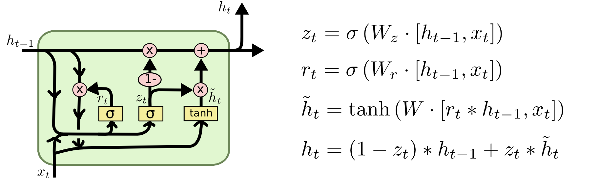

# [Learning Phrase Representations using RNN Encoder-Decoder for Statistical Machine Translation](https://arxiv.org/abs/1406.1078)

## 模型流程

- 
## 要点记录
### What
1. 
### How
1.
### Why
1.
### Result
- 
### Drawbacks
- 
## 参考
- [知乎·人人都能看懂的GRU](https://zhuanlan.zhihu.com/p/32481747)
- [超生动图解LSTM和GPU](https://mp.weixin.qq.com/s?__biz=MzIzNjc1NzUzMw==&mid=2247506068&idx=3&sn=a9b133c2e5448fd7f516b524ce0f7b64&chksm=e8d06fe6dfa7e6f0c3f20f527b96c1b1f6d7d47a0c78e023e72659dcbb88d61a2dc3fe595b49&mpshare=1&scene=2&srcid=1017sNxQqedoLUbeEpE8OISm&from=timeline&ascene=14&devicetype=Windows+10&version=62060841&nettype=WIFI&abtest_cookie=BAABAAoACwASABMABQAjlx4AVpkeAMuZHgDZmR4A3JkeAAAA&lang=zh_CN&pass_ticket=GBPd6%2B5%2FLlUvBeCqINiY1wpuzP7lGEqZ56ehbFLEDOpO9Vn%2B1vWUL4XSYxrj%2BK1g&wx_header=1&key=89c13119caee7b320e68e880eaad36d33de64a419603510389cd0931a14b2720087726ef52a87442ca16ec9399103c34f3048a70de87946e3bbec139fdcb90f92742ab270fff31580c8403d1884a385f&uin=NTg0MjEwMDE4&exportkey=AxIZEsXGek4ilXqh6x9f1Zc%3D)
## 提问
1. 
