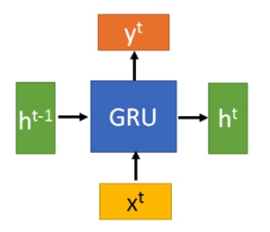

# [Learning Phrase Representations using RNN Encoder-Decoder for Statistical Machine Translation](https://arxiv.org/abs/1406.1078)

## 模型流程
### GRU结构

- `GRU`的输入为`当前时间步的输入x^t`和`上一个节点传递下来的隐状态h^(t-1)`，输出为`当前时间步的输出y^t`和`传递给下一个节点的隐状态h^t`。在`GRU`中，`y^t = h^t`
### 计算方法

- 更新门：`z^t = sigmoid(Linear(h^(t-1)|x^t))`，拼接上一个节点的隐状态`h^(t-1)`与当前时间步输入`x^t`作为输入，通过以sigmoid作为激活函数的单层全连接层，获得输出向量。其值位于0~1之间，称为门。
- 重置门：`r^t = sigmoid(Linear(h^(t-1)|x^t))`，过程同上，通过另外一个全连接层获得另外一个门。
- 新状态：首先对上一个节点的隐状态进行重置`r^t⊙h^(t-1)`，然后与当前时间步输入`x^t`拼接作为输入，通过以hanh作为激活函数的单层全连接层，输出作为新状态`h~^t`
- 输出：按权结合旧状态`h^(t-1)`与新状态`h~^t`作为输出`h^t`并直接看作隐状态传递给下一个时间步
## 要点记录
- 对于整句分类等任务可以直接取最后一个时间步的输出作为整个句子的表征向量，因为其包含所有单词的信息
## 参考
- [知乎 人人都能看懂的GRU](https://zhuanlan.zhihu.com/p/32481747)
- [超生动图解LSTM和GPU](https://mp.weixin.qq.com/s?__biz=MzIzNjc1NzUzMw==&mid=2247506068&idx=3&sn=a9b133c2e5448fd7f516b524ce0f7b64&chksm=e8d06fe6dfa7e6f0c3f20f527b96c1b1f6d7d47a0c78e023e72659dcbb88d61a2dc3fe595b49&mpshare=1&scene=2&srcid=1017sNxQqedoLUbeEpE8OISm&from=timeline&ascene=14&devicetype=Windows+10&version=62060841&nettype=WIFI&abtest_cookie=BAABAAoACwASABMABQAjlx4AVpkeAMuZHgDZmR4A3JkeAAAA&lang=zh_CN&pass_ticket=GBPd6%2B5%2FLlUvBeCqINiY1wpuzP7lGEqZ56ehbFLEDOpO9Vn%2B1vWUL4XSYxrj%2BK1g&wx_header=1&key=89c13119caee7b320e68e880eaad36d33de64a419603510389cd0931a14b2720087726ef52a87442ca16ec9399103c34f3048a70de87946e3bbec139fdcb90f92742ab270fff31580c8403d1884a385f&uin=NTg0MjEwMDE4&exportkey=AxIZEsXGek4ilXqh6x9f1Zc%3D)
- [CSDN Gated Recurrent Unit（GRU）](https://blog.csdn.net/u012328159/article/details/87907739)
