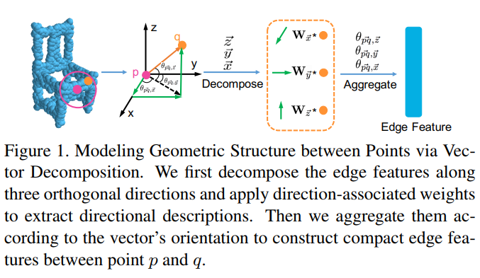
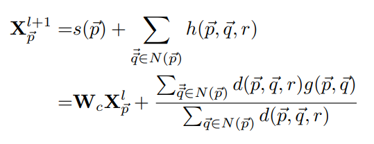
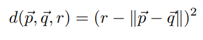
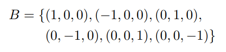
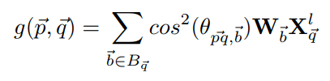
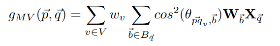
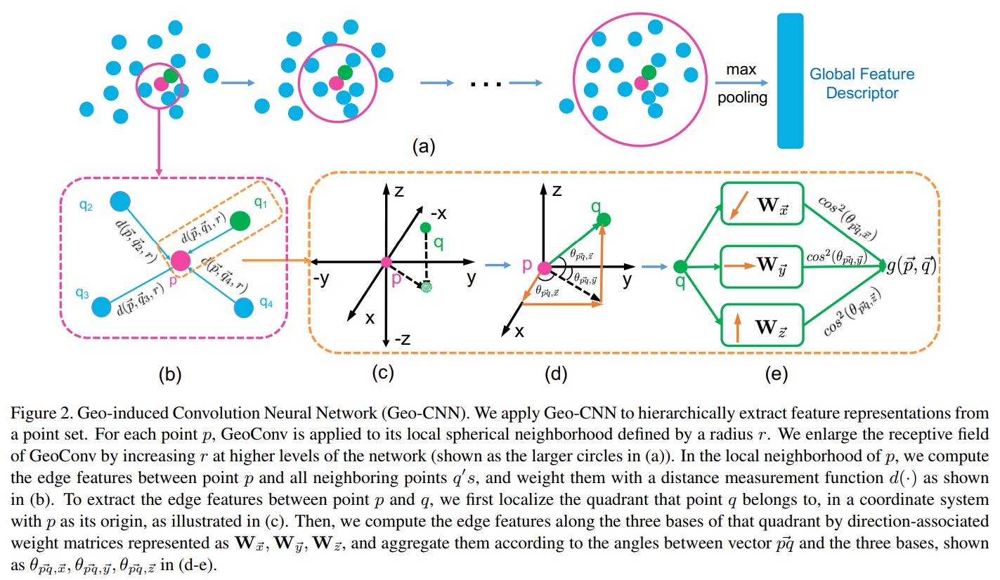
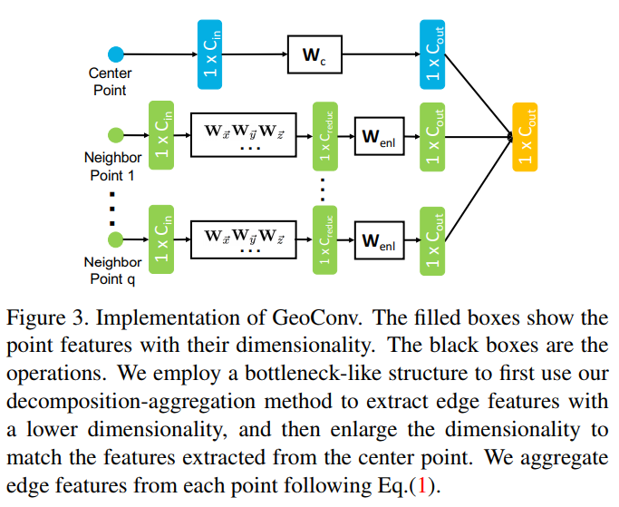

# [Modeling Local Geometric Structure of 3D Point Clouds using Geo-CNN](https://arxiv.org/abs/1811.07782)

## 背景

- 作者认为直接以边向量通过MLP获得权重容易过拟合，因为边的几何结构多变，方差大；另外，直接映射至高维空间有可能丢失原有的几何结构，因此需要关注显式几何结构建模
- 改造局部点云中邻点与中心点的特征提取方式：首先将边缘特征提取过程分解成三个正交的基，然后根据边缘向量与基之间的夹角对提取的特征进行聚合。这鼓励了网络在整个特征提取层次中保持欧氏空间的几何结构。
## 模型流程
- 简单来说就是作者把边特征看作3个基向量所持有的特征的组合，网络所需要学习的是基向量的特征，而基特征组合成边特征的方式是作者设定的，不可更改的，作者根据几何关系（边的方向、模长）推理组合后的基特征即边特征

- `p`点在`l + 1`层的特征 = `MLP(前一层特征)` + 所有边缘特征`g(pq)`的加权和

- 权重为`(邻域球半径 - 边的模长)^2`
- 这个公式有两个很好的性质：
  - 结果随模长单调递减，离球心越近，权重越高
  - 当球半径增大时，两个相近邻点与中心点构成的权重差距减小。也就是说感受野扩大时，需要更大的模长差距来获得相同的权重差，要求随感受野扩大

- 作者将欧式坐标系分为6个基向量，分别对应6个不同的权重矩阵

- 每个基向量拥有不同的权重，所以上一层特征`X^l_q`会通过6个不同的全连接层获得按照不同基升维后的结果
- 某一条边的特征等于其所在象限对应的3个基特征的加权和，权重为`cos^2(边向量与基向量构成的夹角)`，即按角度分权，注意3个`cos^2`的和始终为1

- 这里利用了一个多视图的`trick`，就是把整个点云按照`z轴`旋转获得不同视角`v`下获得的边权重，然后加权聚合，其中`w_v`可学习
- `v`取等间隔的`10 ~ 40`个视角效果差不多，文中约提`0.5%`

## 其他

- 整个流程图，这里的`θ`好像画错地方了，不过下面的解释没问题

- `GeoConv`采用`bottleneck`结构

## 疑惑
1. 这种操作是怎么减轻过拟合的？方差越大就约容易过拟合？
2. 为什么将坐标轴分为正负轴，构造6个基向量？
