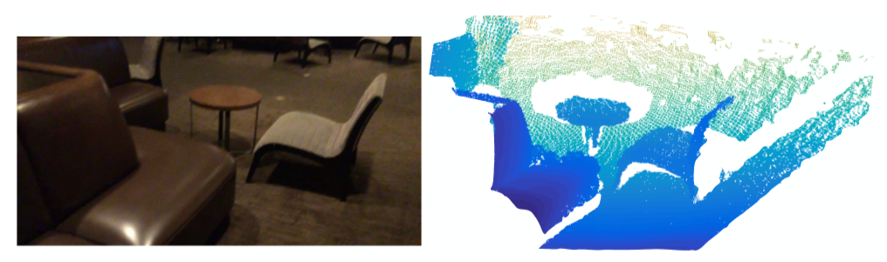
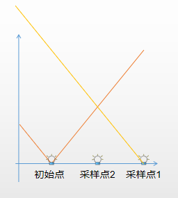
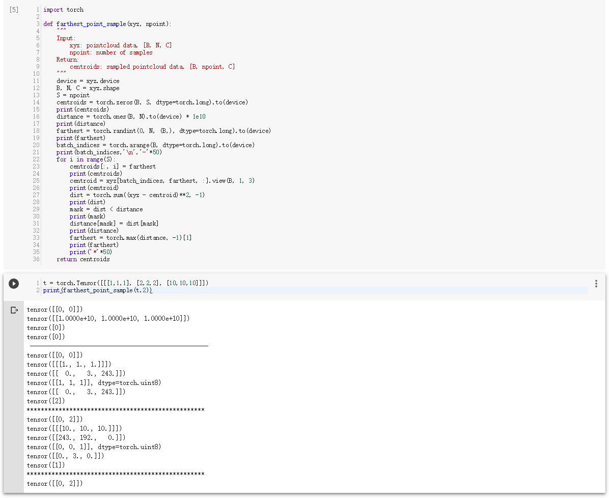
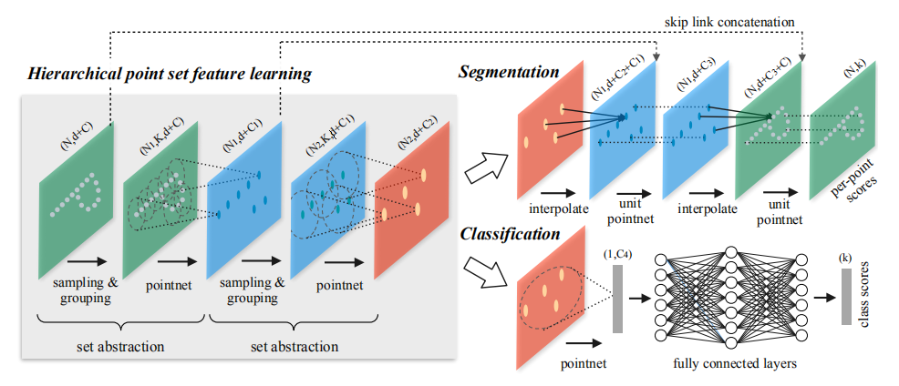
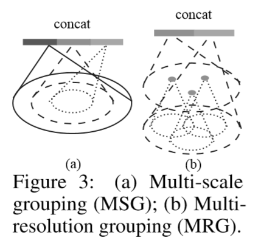
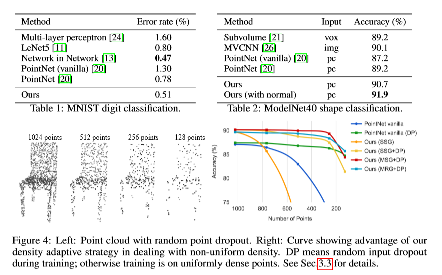
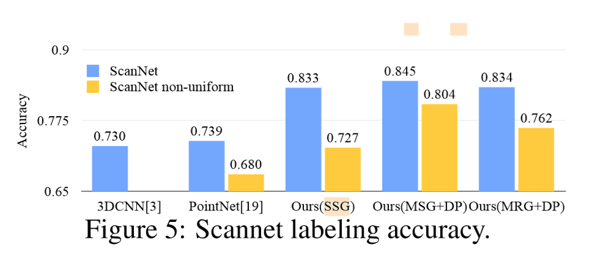
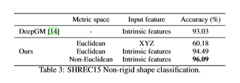
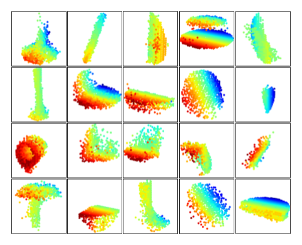

# [PointNet++: Deep Hierarchical Feature Learning on Point Sets in a Metric Space](https://arxiv.org/abs/1706.02413)

以前很少有人研究深度学习在点集中的应用。PointNet是这方面的先驱。然而，PointNet并不能捕捉到由度量（metric）空间点所产生的局部结构，从而限制了它识别分类精密模型（fine-grained patterns）和对复杂场景的通用性。在PointNet++中，我们引入了一个递归地将PointNet应用于输入点集的嵌套分区的层次神经网络。通过度量空间距离，我们的网络能够在增长的上下文尺度中学习局部特征。进一步观察到，点集采样通常是不同密度的，这导致训练在均匀密度下的网络性能大大降低，我们提出了新的集学习层，自适应地结合来自多个尺度的特征。实验表明，我们的PointNet++网络能够高效、鲁棒地学习深度点集特性。特别是，在具有挑战性的3D点云基准测试中，获得了明显优于最先进水平的结果。

## 背景
- FPS 最远点采样法：Farthest Point Sampling 的原理是先随机选一个点,然后选择离这个点距离最远的点加入点集,然后继续迭代,选择距离点集中所有点最远的点,直到选出需要的个数为止。
    
    
    
    
    
## 模型流程

- set abstraction: 主要分为Sampling layer、Grouping layer 和PointNet layer
    - Sampling layer：给定输入点集｛x1，x2，x3，……｝，其中包含 N 个点，通过 FPS 采样获得 N' 个点。
    - Grouping layer：本层输入为 `① N * (d + C) = 点数量 * (三维欧几里得坐标 + 点特征)  ② N' * d = N' 个采样点坐标`，输出是 G 组 `N' * K * (d + C)` 特征，K 代表邻域点数量，由 KNN 计算得出， K 在不同的组是不同的。采用 Ball query 分组算法，原理: 给定中心点，把给定半径内的点都包括进来，同时给定邻居点个数上限，提取距离最近的前 K 个邻居，如果数量不足则复制自身凑数。
    - PointNet layer：输入为 G 组的 `N' * K * (d + C)`，输出为一个 `N' * (d + C')`。作者利用一个迷你的 PointNet 对每组的 K 个点提取组全局特征然后把 G 个组的组全局特征向量拼接起来。

通过多个set abstraction，最后进行分类和分割：

- 分类：将提取出的特征使用PointNet进行全局特征提取

- 分割：NL-1是集合抽象层的输入，NL是集合抽象层的输出。NL是采样得到的，NL-1肯定大于等于NL。在特征传播层，将点特征从NL传递到NL-1。根据NL的点插值得到NL-1，采用邻近的3点反距离加权插值。将插值得到的特征和之前跳跃连接的特征融合，再使用PointNet提取特征

## 要点记录
### What
1. PointNet没有捕获到由度量（metric）引起的局部结构特征。
2. 点的密度或其他属性在不同的位置上可能不一致——在三维扫描中，密度变化可以来自透视效果、径向密度变化、移动等。
### How
1. PointNet++使用了分层抽取特征的思想，把每一层叫做set abstraction。每一层分为三部分：采样层、分组层、PointNet层。
    - 首先来看**采样层**，采样层从输入点中选择一组点，定义局部区域的质心。为了从稠密的点云中抽取出一些相对较为重要的中心点，采用FPS（farthest point sampling）最远点采样法。
    - 然后是**分组层**，分组层通过寻找质心周围的“相邻”点来构造局部区域集。PointNet++在多个尺度上利用邻近球法，获得多组局部特征，以实现健壮性和细节捕获。
    - **PointNet层**使用一个迷你PointNet结构作为局部特征学习模块，将输入编码为特征向量。
    
    总之就是类比了2D空间中的离散卷积，以球半径作为卷积核尺寸。
  
2. 通过两种不同的方式获得多组特征后拼接为一组特征向量。

    
    
    a. 比较直接的想法是对不同尺度的局部提取特征并将它们串联在一起，如图(a)所示。但是因为需要对每个局部的每个尺度提取特征，其计算量的增加也是很显著的。
    
    b. 为了解决MSG计算量太大的问题，作者提出了MRG。此种方法在某一层对每个局部提取到的特征由两个向量串联构成，如图(b)所示。第一部分由其前一层提取到的特征再次通过特征提取网络得到，第二部分则通过直接对这个局部对应的原始点云数据中的所有点进行特征提取得到。
### Why
1. - 与以固定步长扫描3D空间的cnn相比，我们的局部接受域既依赖于输入数据，也依赖于度量，因此更有效率和效果。
   - ball query 的局部邻域保证了一个固定的区域尺度，从而使局部区域特征在空间上具有更好的可泛化性。该网络在训练过程中使用dropout，学习自适应地检测不同尺度下的权值模式，并根据输入数据结合多尺度特征。
   - 提取全局特征。
2. 作者利用固定半径多尺度或多分辨率地拼接特征向量，并利用dropout使网络自适应地学习不同密度的特征。
### Result
- 分类结果：

    

    - `SSG：单一尺度   MSG：多尺度   MRG：多分辨率`
- 语义分割（不带RGB信息）：

    
    
    
- 非刚性分类：

    
    
- 特征可视化：

    
### Drawbacks
- 对点集进行采样丢失了信息
- 对点集的采样鲁棒性差，无法避免采样到噪点，影响精度
- 多尺度的特征提取并未直接解决密度不均匀的问题
## 好句
- CNN介绍：However, exploiting local structure has proven to be important for the success of convolutional architectures. A CNN takes data defined on regular grids as the input and is able to progressively capture features at increasingly larger scales along a multi-resolution hierarchy. At lower levels neurons have smaller receptive fields whereas at higher levels they have larger receptive fields. The ability to abstract local patterns along the hierarchy allows better generalizability to unseen cases.
## 参考
- [博客解析](https://blog.csdn.net/qq_15332903/article/details/80261951)
- [译文（上）](https://blog.csdn.net/weixin_40664094/article/details/83902950)
- [译文（下）](https://blog.csdn.net/weixin_40664094/article/details/83932046)
- [知乎解读](https://zhuanlan.zhihu.com/p/44809266)
- [PointNet系列博客](https://blog.csdn.net/oliongs/article/details/82698744)
- [Pytorch代码](https://github.com/halimacc/pointnet3)
## 提问
1. 非刚性分类的实验没看懂。
2. 上采样层的线性插值公式如何理解？
