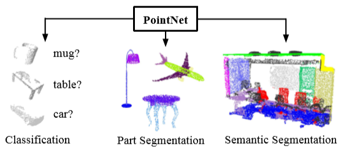
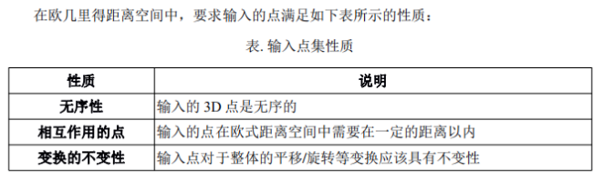
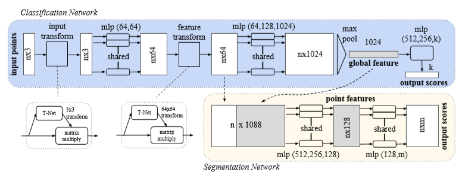
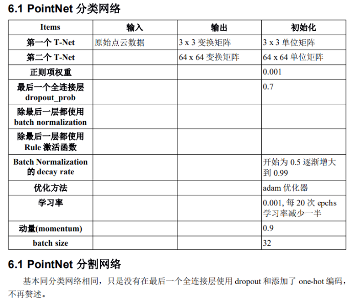
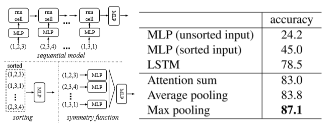
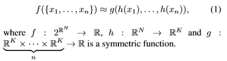
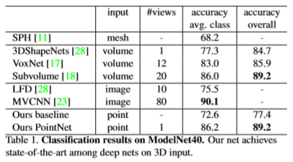
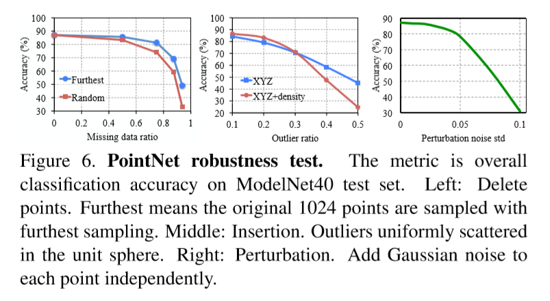
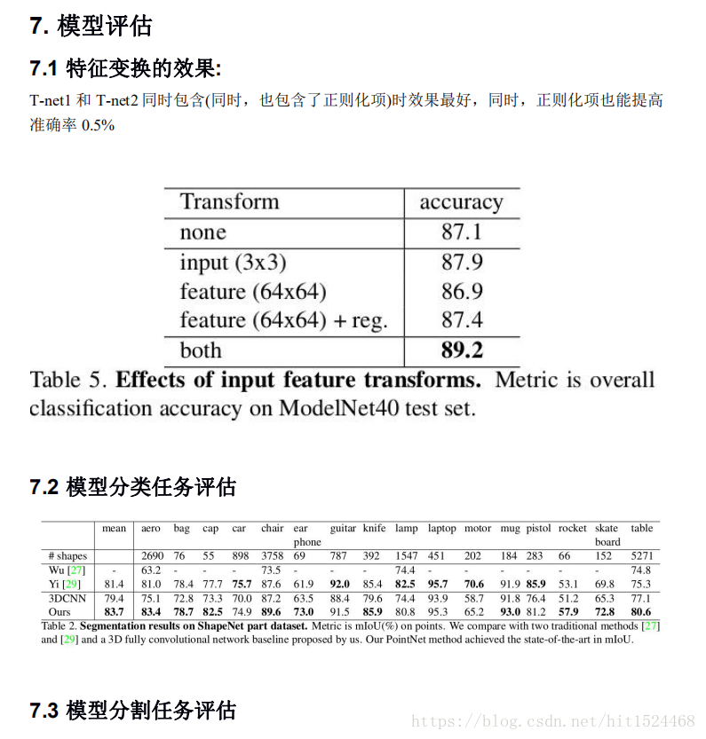
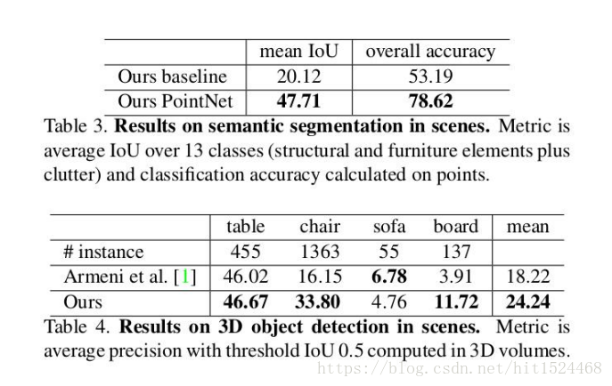

## [PointNet: Deep Learning on Point Sets for 3D Classification and Segmentation](https://arxiv.org/pdf/1612.00593v2.pdf)

- 点云是一种重要的几何数据结构类型。由于其不规则的格式，大多数研究人员将这些数据转换成规则的三维体素网格或图像集合。然而，这将导致不必要的数据量，并引发问题。本文设计了一种新的直接计算点云的神经网络，它很好地考虑了输入点的排列不变性。我们的网络名为PointNet，它为从对象分类、部件分割到场景语义解析的应用程序提供了统一的体系结构。虽然很简单，但是PointNet非常高效。从经验上看，它表现出与现有水平相当甚至更好的强劲表现。从理论上讲，我们提供了分析来理解网络已经学到了什么，以及为什么网络在输入扰动和破坏方面是健壮的。
### 背景
#### 点集的性质

### 模型流程

- 分类：N * 3 的二维张量（点的数量 * xyz坐标）Input → 空间变换层 T-Net → MLP → 空间变换层 T-Net → MLP → 列MaxPooling → 全连接 → Output
- T-Net: 提取1024个全局特征并转换为3×3的线性变换矩阵，学习如何对点云做线性变换。具体过程：三层卷积(stride=1)，相当于利用一个MLP对每个点分别做非线性变换，升维至1024，获得1024×N的张量，最大池化获得长1024的全局特征向量，MLP降维至9。

### 要点记录
#### What
1. 点云具有非欧几里得结构，转换为常规3D体素网格或图像集合会耗费大量资源并引起问题。
2. 点云只是一组点并因此其成员应该具有排列不变性，这需要在网络计算中进行某些对称化。
3. 还需要考虑对刚性运动（平移、旋转等）的进一步不变性。
#### How
1. PointNet直接利用点云数据进行计算。
2. 利用最大池化构造对称函数。
3. 使用T-Net提取全局信息，对点云施加线性变换，矫正刚性变化。（特征空间中的变换矩阵具有比空间变换矩阵高得多的维度，这极大地增加了优化的难度。因此，我们在softmax训练损失中增加了一个正则化项。）
#### Why
1. 常规3D体素网格或图像集合（例如视图），数据表示变换使得得到的数据不必要地大量增加同时还引入了可能模糊数据自然不变性的量化伪像（quantization artifacts）。点云是简单而统一的结构，可以避免网格的组合不规则性和复杂性，因此更容易学习。
2. 为了使模型对输入排列不变，存在三种策略：1）将输入排序为规范顺序; 2）将输入视为训练RNN的序列，但通过各种排列来增加训练数据; 3）使用简单的对称函数来聚合来自每个点的信息。这里，对称函数将n个向量作为输入，并输出对输入顺序不变的新向量。例如，`+ 和 *`运算符是对称二进制函数。
  - 在高维空间中实际上并不存在稳定的排序w.r.t.一般意义上的点扰动。这可以通过矛盾很容易地显示出来。如果存在这样的排序策略，则它定义高维空间和1d实线之间的双射映射。不难看出，要求排序是稳定的，因为点扰动等同于要求该图在尺寸减小时保持空间接近度，这是在一般情况下无法实现的任务。因此，排序不能完全解决排序问题，并且由于排序问题仍然存在，网络很难从输入到输出学习一致的映射。如实验中所示（图5），我们发现直接在排序点集上应用MLP表现不佳，但稍微好于直接处理未排序的输入。
 - 使用RNN的想法将点集视为顺序信号，并希望通过用随机置换序列训练RNN，RNN将变得对输入顺序不变。然而，在“OrderMatters”[25]中，作者已经表明顺序确实很重要，不能完全省略。虽然RNN对于具有小长度（数十个）的序列的输入排序具有相对良好的鲁棒性，但是难以扩展到数千个输入元素，这是点集的常见大小。根据经验，我们还表明基于RNN的模型的表现不如我们提出的方法（图5）。

  - 我们的想法是通过对集合中的变换元素应用对称函数来近似一个在点集上定义的一般函数。相当于一个高级的reduce函数（python functools 模块中的内置函数）。我们通过 MLP 来近似 h，并通过单一变量函数和最大池函数的组合来近似 g。
  

3. 点云经历某些几何变换（例如刚性变换）时，语义标记是不变的。因此，我们期望我们的点集的学习表示对这些变换是不变的。一种自然的解决方案是在特征提取之前将所有输入集对齐到规范空间。
#### Result

#### Drawbacks
- PointNet仅考虑自身信息与全局信息，完全忽略了邻域信息。
- T-Net效果不是很好，仅提升2%，用的参数很多。
- 网络不够深，没有残差结构。
### 参考
- [译文](https://www.jianshu.com/p/2307cebbb017)
- [解析](https://blog.csdn.net/hit1524468/article/details/80023779)
- [Pytorch Code](https://github.com/halimacc/pointnet3)
### 提问
- 为什么变换姿态矩阵是3*3，而不增加一个维度学习仿射变换矩阵？
- why2中否定排序策略的解释如何理解？
